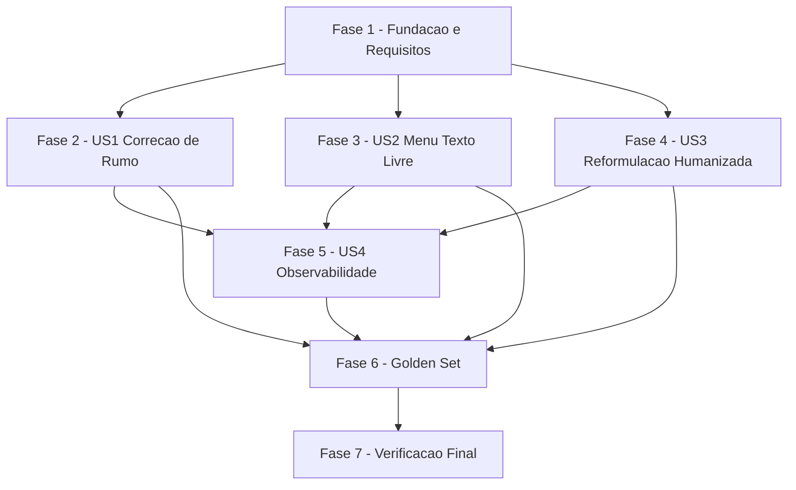

# Tarefas Agente SDR GoldIncision - Fluidez Agêntica de Intenção no Atendimento

Escopo: tornar a **interpretação** das mensagens do lead mais fluida e
humana em três frentes — correção de rumo mid-jornada (US1), texto livre no
menu inicial (US2) e reformulação humanizada sem repetição verbatim (US3) —
mais observabilidade aditiva (US4), mantendo o motor de decisão de fluxo
**100% determinístico** e **sem migration**. Fonte: `spec.md`, `plan.md`,
`research.md` (10 decisões), `data-model.md`, `contracts/*.md`,
`quickstart.md` (15 cenários), `checklists/requirements.md` (42 items, 7
gaps).

**Legenda de status:**
- `[ ]` Pendente
- `[~]` Em andamento
- `[x]` Concluido
- `[!]` Bloqueado

**Legenda de criticidade:**
- `[C]` Critico - Impacto financeiro direto ou bloqueante (segurança/handoff/
  determinismo de roteamento/preservação de perfil)
- `[A]` Alto - Funcionalidade essencial do gap fechado
- `[M]` Medio - Necessario mas sem urgencia imediata (observabilidade,
  conteúdo textual, golden set)

---

## FASE 1 - Fundação e Requisitos

### 1.1 Fechar gap de checklist CHK008 — conteúdo do léxico compartilhado `[A]`

Ref: checklists/requirements.md CHK008 (Gap: mecanismo de reconhecimento de
"erro leve" é claro — pertencimento a `_LEXICO_CAMINHOS` via `_norm()` — mas
o CONTEÚDO das variantes/typos não está enumerado); Spec FR-003, FR-013;
research.md Decision 1

- [x] 1.1.1 Levantar, para cada um dos 6 caminhos do `CaminhoMapaMestre`, a
  lista de nomes de produto/caminho e variantes normalizadas conhecidas
  (incluindo erros leves de digitação/acentuação já observados, ex.:
  "harmoização"/"harmonização", "glutea"/"glútea") em PT <!-- entregue como
  `_LEXICO_CAMINHOS` em app/core/flow.py (dict[int, set[str]], 6 caminhos),
  DRY com 1.2.1 -->
- [x] 1.1.2 Repetir 1.1.1 para EN e ES (nomenclatura equivalente por idioma)
  <!-- variantes EN/ES incluidas no mesmo set por caminho em
  `_LEXICO_CAMINHOS` (matching e language-agnostic apos _norm()) -->
- [x] 1.1.3 Levantar os tokens/frases de `_MARCADORES_CORRECAO` por idioma
  (pt: "na verdade", "me enganei", "prefiro"; en: "actually"; es: "de
  hecho"; etc.), incluindo variantes leves <!-- entregue como
  `_MARCADORES_CORRECAO: dict[str, set[str]]` (pt/en/es) em app/core/flow.py -->
- [x] 1.1.4 Escrever teste de unidade que itera cada entrada do léxico
  levantado e confirma matching por token/substring via `_norm()` —
  determinístico, nunca fuzzy-matching probabilístico (Decision 1)
  <!-- tests/test_flow.py: 16 testes novos (cobertura + parametrize sobre
  cada caminho/idioma), incluindo teste anti-fuzzy-matching -->

### 1.2 Implementar léxico compartilhado e fallback agentico confidence-gated `[C]`

Ref: research.md Decision 1/2, contracts/slot-troca-caminho.md, plan.md
§Mapeamento FR-002/003/004; Constitution Princípio II (Anti-Alucinação
Rígida)

- [x] 1.2.1 Criar constantes `_LEXICO_CAMINHOS: dict[int, set[str]]` e
  `_MARCADORES_CORRECAO: dict[str, set[str]]` em `app/core/flow.py`,
  populadas com o conteúdo de 1.1, reusando `_norm()` (`app/core/flow.py:2805`)
  <!-- entregue junto com 1.1 (mesma onda) para evitar duplicar o mesmo
  conteudo em dois passos — ver nota DRY em 1.1.1. Constantes inseridas
  logo apos `_destino_logico_por_caminho()`, antes do bloco i18n `_T`. -->
- [ ] 1.2.2 Criar `_SLOT_SCHEMA_TROCA_CAMINHO` em `app/core/interpret.py`
  conforme `contracts/slot-troca-caminho.md` — reusar `SlotExtractor`, NÃO
  tocar `app/core/intent.py`/`IntentClassifier.classify()` (contrato de
  2-tupla protegido por gotcha)
- [ ] 1.2.3 Implementar `_valor_para_caminho(valor: str | None) -> int |
  None` como função pura de mapeamento FECHADO (`dict.get(valor, None)` ou
  `match` exaustivo com `case _: return None`) — invariante **S-6**: nunca
  levanta exceção, nunca adivinha o caminho mais "parecido" para um valor
  fora do enum (achado do gate `owasp-security`)
- [ ] 1.2.4 Adicionar `INTENT_SWITCH_CONFIDENCE_THRESHOLD` (pydantic-settings,
  default `0.6`) em `app/config.py`, `.env.example` e `stack.yml`
- [ ] 1.2.5 Escrever testes de unidade para `_valor_para_caminho` cobrindo os
  6 valores válidos de `valores_esperados` + `None` + string arbitrária fora
  do enum (garante S-6 — nunca propaga exceção nem alucina)
- [ ] 1.2.6 Escrever teste de unidade confirmando `SlotExtractor.aceitar()`
  só aceita quando `valor is not None AND confianca >=
  settings.intent_switch_confidence_threshold` (S-1/S-2)

### 1.3 Fechar gaps de checklist CHK009/CHK010/CHK011 — conteúdo i18n pendente `[M]`

Ref: checklists/requirements.md CHK009, CHK010, CHK011 (Gap: algoritmos e
schemas definidos, conteúdo textual concreto ainda não redigido); Spec
FR-005, FR-008, FR-015; Constitution Princípio IV (Comunicação Consultiva
Premium)

- [ ] 1.3.1 Redigir bloco i18n de confirmação breve e natural de troca de
  caminho (PT/EN/ES) — CHK009, FR-005, tom alinhado ao Princípio IV
- [ ] 1.3.2 Redigir texto de pergunta de desambiguação para os pares de
  caminhos plausivelmente ambíguos (PT/EN/ES) — CHK010, FR-008/012 (exatamente
  2 caminhos, nunca reapresentar o menu completo)
- [ ] 1.3.3 Redigir 2-3 variantes de `_REFORMULACOES` por idioma (PT/EN/ES) —
  CHK011, FR-015; reservar espaço para referência breve ao que o lead disse
  quando possível, sem repetir a introdução/saudação do bloco original

---

## FASE 2 - US1: Correção de Rumo Mid-Jornada (P1)

### 2.1 Estado de confirmação/desambiguação pendente (`troca_pendente`) `[A]`

Ref: contracts/estado-troca-pendente.md, data-model.md §Estado de
Confirmação/Desambiguação Pendente; research.md Decision 6

- [ ] 2.1.1 Adicionar `TROCA_PENDENTE_FIELD` em `app/core/redis_keys.py`
  (hash `estado:{chamadoId}`, mesmo padrão de `OVERFLOW_BLOCOS_FIELD`/
  `OVERFLOW_IDIOMA_FIELD`)
- [ ] 2.1.2 Adicionar `SessionContext.troca_caminho_pendente: Optional[dict]
  = None` em `app/core/memory.py` (mesmo padrão de `overflow_blocos`/
  `overflow_idioma`)
- [ ] 2.1.3 Implementar leitura fail-open (P-4): `HGET` ausente ou JSON
  corrompido é tratado como "sem pergunta pendente" — nunca bloqueia o
  atendimento
- [ ] 2.1.4 Implementar limpeza explícita (`HDEL`) tanto no caminho de
  sucesso (confirmação/escolha reconhecida) quanto no de falha
  (negação/não-reconhecimento) — P-3, nunca fica "pendurado"
- [ ] 2.1.5 Testes de escrita/leitura/limpeza do campo cobrindo os 2 tipos
  (`confirmacao` com 1 destino, `desambiguacao` com exatamente 2 destinos)

### 2.2 Detector centralizado em `_reformular_ou_handoff` `[C]`

Ref: research.md Decision 3 (choke-point único), plan.md linha 85-93;
Constitution Princípio I (Fidelidade ao Fluxo Oficial)

- [ ] 2.2.1 Adicionar parâmetro obrigatório `user_message: str` à assinatura
  de `_reformular_ou_handoff` (`app/core/flow.py:1448`) — ANTES de
  incrementar `_tent_bump`
- [ ] 2.2.2 Atualizar mecanicamente os 10 call sites existentes
  (`app/core/flow.py:1641/1692/1737/1877/1885/1904/2059/2071/2083/2095`) para
  passar `user_message` — sem lógica nova em cada site (essa mudança é só o
  encanamento; a lógica de conteúdo pergunta-curta vs bloco-de-entrada é
  tratada na FASE 4, task 4.2)
- [ ] 2.2.3 Implementar pipeline do detector dentro de
  `_reformular_ou_handoff`: (1) léxico determinístico primeiro (1.2.1); (2)
  SOMENTE se não casar, fallback agentico confidence-gated (1.2.2/1.2.3) —
  invariante S-5
- [ ] 2.2.4 Candidato claro COM marcador explícito de correção → despachar
  direto para o caminho-alvo via `_despachar_caminho` (sem pergunta
  intermediária)
- [ ] 2.2.5 Candidato claro SEM marcador explícito (intenção implícita) →
  setar `troca_pendente` tipo=`confirmacao` (edge case da spec, texto de
  1.3.1)
- [ ] 2.2.6 Candidato ambíguo entre EXATAMENTE 2 caminhos → setar
  `troca_pendente` tipo=`desambiguacao` (FR-008/012, texto de 1.3.2)
- [ ] 2.2.7 Candidato ambíguo entre 3+ caminhos ou não reconhecido por
  nenhum estágio → cai no comportamento existente de reformulação/handoff
  (FR-010, dec-009 — sem estender FR-008)
- [ ] 2.2.8 Implementar leitura de `troca_pendente` no INÍCIO de
  `_process_core`, antes do resolver do nó (P-2/clarify Q1/dec-007) —
  mensagem corrente interpretada EXCLUSIVAMENTE como resposta à pendência;
  negação/não-reconhecimento limpa o campo e conta como tentativa da
  pergunta **original** (não uma tentativa nova)
- [ ] 2.2.9 Teste de regressão: `_ETAPAS_AGUARDANDO_RESPOSTA` (fix #9)
  permanece intocado na classificação GLOBAL de intenção
  (`app/core/flow.py:~1250-1300`) — o novo detector é mecanismo distinto que
  só roda após o resolver específico da etapa já ter falhado (Decision 4)
- [ ] 2.2.10 Teste de regressão: `_aplicar_overflow_resume` continua
  precedendo `_process_core` sem alteração de ordem — enquanto
  `context.overflow_blocos` não vazio, `troca_pendente` nunca é lido nem
  escrito (Decision 5/P-1, quickstart Cenário 10)
- [ ] 2.2.11 Teste de regressão: resposta legítima e direta a uma pergunta
  pendente NUNCA é lida como troca de caminho (FR-009, quickstart Cenário 4)

### 2.3 Preservação de perfil e zeragem de contador na troca `[C]`

Ref: Spec FR-006, FR-007, FR-021; data-model.md §Relationships

- [ ] 2.3.1 Teste confirmando que nenhum campo de qualificação (`eh_medico`,
  `especialidade`, `experiencia_corporal`, `idioma`, `produto_interesse`) é
  resetado ou requisitado de novo após uma troca de caminho (perfil já é
  independente de `caminho`/`etapa` por construção — sem código novo
  necessário, apenas verificação)
- [ ] 2.3.2 Chamar `_tent_clear` (já existente) na etapa abandonada durante
  o despacho da troca (FR-007), sem alterar os contadores de orçamento de
  turnos da sessão (`turnos_sessao`/`turnos_no_no`)
- [ ] 2.3.3 Teste: ao retornar a um caminho já visitado, o despacho sempre
  entra pela etapa inicial do caminho-alvo — NUNCA retoma o ponto salvo de
  uma visita anterior (FR-021, quickstart Cenário 12)
- [ ] 2.3.4 Teste: correção de rumo para o MESMO caminho já ativo não gera
  troca, reinício de contadores nem qualquer efeito colateral perceptível
  (edge case, quickstart Cenário 11)

---

## FASE 3 - US2: Menu Inicial em Texto Livre (P2)

### 3.1 Fast-path de texto livre no menu inicial `[A]`

Ref: Spec FR-011/012/013, plan.md linha 94 (`app/core/flow.py:1283`)

- [ ] 3.1.1 Reusar `_LEXICO_CAMINHOS`/`_norm()` (1.2.1) no bloco "2.bis
  Menu" (`app/core/flow.py:1283`) para reconhecer resposta em texto livre —
  MESMO reconhecimento determinístico usado pelo detector de troca (FR-011)
- [ ] 3.1.2 Implementar desambiguação quando a resposta livre for compatível
  com EXATAMENTE 2 caminhos (FR-012) — pergunta direta, NUNCA reapresentar o
  menu completo de 6 opções
- [ ] 3.1.3 Implementar fallback ao comportamento existente de reformulação
  quando a resposta livre for compatível com 3+ caminhos (dec-009/clarify
  Q4) — sem estender FR-008 ao menu inicial
- [ ] 3.1.4 Confirmar que erro leve de digitação/acentuação na resposta
  livre não impede o reconhecimento correto quando o caminho pretendido é
  reconhecível (FR-013)

### 3.2 Testes de regressão do fast-path do menu `[M]`

Ref: quickstart.md Cenários 5 e 6

- [ ] 3.2.1 Teste: resposta livre com nome de produto (com e sem erro leve)
  direciona ao caminho correto sem exigir reenvio de número (quickstart
  Cenário 5)
- [ ] 3.2.2 Teste: resposta livre ambígua entre 2 caminhos gera pergunta
  única de desambiguação, sem reapresentar o menu (quickstart Cenário 6)
- [ ] 3.2.3 Teste: resposta livre que não indica claramente nenhum caminho
  segue o comportamento existente de reformulação (não trava, não falha
  silenciosamente)

---

## FASE 4 - US3: Reformulação Humanizada (P2)

### 4.1 Separar pergunta-curta de bloco-de-entrada e ciclo de variantes `[C]`

Ref: research.md Decision 7 (causa raiz + fix), Spec FR-014/FR-015,
dec-011/dec-012 (clarify Q4 — ciclo sequencial determinístico)

- [ ] 4.1.1 Criar `_REFORMULACOES: dict[str, list[str]]` (pool i18n, conteúdo
  de 1.3.3) — bloco distinto de `_ACKS` (aberturas de confirmação) e do
  atual único prefixo `"nao_entendi"`
- [ ] 4.1.2 Implementar seleção `variante_idx = (n - 1) % len(pool)` em
  `_reformular_ou_handoff` — ciclo sequencial determinístico pelo número da
  tentativa (garante por construção que a variante do turno imediatamente
  anterior nunca se repete, FR-015)
- [ ] 4.1.3 Implementar composição final `_REFORMULACOES[idioma][variante_idx]
  + pergunta_curta` — substitui o reenvio verbatim atual de `pergunta` em
  `n == 1` (causa raiz: hoje `_reformular_ou_handoff` só prefixa a partir da
  SEGUNDA tentativa, `n >= 2`, `app/core/flow.py:1463-1466`; a primeira
  reformulação reenviava o bloco completo sem qualquer alteração)
- [ ] 4.1.4 Teste de unidade: `variante_idx` é reprodutível/determinístico e,
  por construção, nunca repete a variante do turno imediatamente anterior
  (FR-015, testável byte-a-byte no golden set)

### 4.2 Fechar gap de checklist CHK003 — auditoria individual dos 10 call sites `[C]`

Ref: checklists/requirements.md CHK003; research.md Decision 3/7. Achado
desta decomposição (leitura direta de `app/core/flow.py`): dos 10 call
sites de `_reformular_ou_handoff`, **3** passam um bloco estático `_t(...)`
como `pergunta` (candidatos a conter saudação/conteúdo de entrada
embutidos) e **7** passam o retorno de um gerador dinâmico `_gerar_pergunta_*`
(candidatos a já serem "bare").

- [ ] 4.2.1 Linha 1692 (`ETAPA_SISTEMA_OBJETIVO`, `_t("sistema_etapa1_2",
  idioma)`) — **CONFIRMADO causa raiz** (research.md Decision 7): bloco
  (`app/core/flow.py:354-...`) inicia com a saudação `"Perfeito! 😊\n\n"` +
  explicação longa dos 2 programas, reusado goela-abaixo como bloco de
  entrada (`app/core/flow.py:1826-1830`) E como pergunta de reformulação.
  Extrair uma `pergunta_curta` dedicada (sem a saudação/explicação) para uso
  exclusivo em `_reformular_ou_handoff`
- [ ] 4.2.2 Linha 1641/1660 (`ETAPA_ALUNO_MENU`, `_t("aluno_menu", idioma)`)
  — **achado NOVO desta auditoria** (mesmo padrão estrutural de
  `sistema_etapa1_2`): o bloco (`app/core/flow.py:543-558`) inicia com
  `"Perfeito! Ficarei feliz em direcionar o seu atendimento. 😊\n"` seguido
  do submenu de 6 opções, reusado tanto na apresentação inicial
  (`app/core/flow.py:~1660`) quanto na reformulação (linha 1641). Requer a
  MESMA correção de 4.2.1: extrair `pergunta_curta` dedicada (o submenu sem
  a saudação)
- [ ] 4.2.3 Linha 1877 (`ETAPA_FECHAMENTO`, `_t("fechar_link", idioma)`) —
  auditado: bloco (`app/core/flow.py:263-266`) já é bare — uma única
  pergunta curta ("Gostaria de receber o link...?"), sem saudação/introdução
  embutida. NÃO requer correção de conteúdo; apenas confirmar via teste de
  regressão que a reformulação cíclica (4.1) se aplica sem quebrar o texto
- [ ] 4.2.4 Linhas 1737/1885/1904/2059 (`_gerar_pergunta_medico`) — auditar
  o corpo da função geradora e confirmar que produz texto bare (sem saudação
  embutida); se confirmado, documentar a decisão inline (comentário
  referenciando esta tarefa) — sem código novo além da integração com 4.1
- [ ] 4.2.5 Linha 2071 (`_gerar_pergunta_experiencia`) — mesma auditoria de
  4.2.4
- [ ] 4.2.6 Linha 2083 (`_gerar_pergunta_especialidade`) — mesma auditoria
  de 4.2.4
- [ ] 4.2.7 Linha 2095 (`_gerar_pergunta_escolha_turma`) — mesma auditoria
  de 4.2.4
- [ ] 4.2.8 Consolidar o resultado da auditoria dos 10 call sites (quais
  precisaram de `pergunta_curta` dedicada vs. já eram bare) em comentário no
  código ou nota em `research.md`, fechando definitivamente CHK003

### 4.3 Testes de regressão da reformulação humanizada `[C]`

Ref: quickstart.md Cenário 7 e 8; Spec FR-014/FR-016; SC-001, SC-004;
checklists/requirements.md CHK022

- [ ] 4.3.1 Fechar gap de checklist CHK022 (SC-001): adicionar caso de
  golden set que reproduz LITERALMENTE o cenário real relatado na spec
  (§Contexto e motivação — "harmonização glutea" não reconhecida no menu,
  depois "opa... na verdade quero o curso de harmoização glutea" dentro do
  caminho Sistema GoldIncision), além dos casos genéricos já previstos no
  Cenário 1 do quickstart
- [ ] 4.3.2 Teste: a segunda mensagem não reconhecida para a mesma pergunta
  gera resposta textualmente diferente da primeira, no mesmo idioma, sem
  repetir a introdução/saudação do bloco original (FR-014, SC-004, quickstart
  Cenário 7)
- [ ] 4.3.3 Teste de regressão: limite de tentativas (`_MAX_TENTATIVAS=3`,
  `app/core/flow.py:1456`) e encaminhamento automático a humano preservados
  com o mesmo escopo/limite vigente (FR-016, quickstart Cenário 8)

---

## FASE 5 - US4: Observabilidade Aditiva (P3)

### 5.1 Estender `log_turno` com campos aditivos `[M]`

Ref: contracts/turno-event-extensao.md, data-model.md §Evento de Turno;
Constitution Princípio VI (Isolamento e Segurança de Infraestrutura)

- [ ] 5.1.1 Adicionar parâmetros opcionais (`troca_caminho_origem: int |
  None`, `troca_caminho_destino: int | None`, `troca_metodo: str | None`,
  `troca_confianca: float | None`, `reformulacao_variante: int | None`) a
  `log_turno()` em `app/observability/log.py` — todos com default `None`,
  sem mudança nos campos existentes
- [ ] 5.1.2 Repassar os novos campos a partir de `app/api/webhook.py` para
  `log_turno()` nos pontos onde troca de caminho ou reformulação ocorreram
- [ ] 5.1.3 Confirmar que nenhum campo novo carrega conteúdo bruto da
  mensagem do lead (SEC-LLM-1) — apenas metadados estruturados (números de
  caminho, método, confiança numérica, índice de variante)
- [ ] 5.1.4 Confirmar que `_scrub`/`_mask_number`/`_emit` (já existentes)
  cobrem o evento estendido sem qualquer mudança no pipeline de emissão

### 5.2 Testes de observabilidade `[M]`

Ref: quickstart.md Cenário 14; `sdr-turnos-obs/contracts/turno-event.md`
(contrato original C-1..C-5, preservados)

- [ ] 5.2.1 Estender `test_observability.py` com o shape estendido do
  evento (novos campos presentes conforme `contracts/turno-event-extensao.md`)
- [ ] 5.2.2 Teste: evento continua emitido exatamente 1x por turno mesmo
  quando troca de caminho e/ou reformulação ocorrem no mesmo turno (C-1/C-2
  do contrato original preservados)
- [ ] 5.2.3 Teste: os registros de troca de caminho e de reformulação são
  identificáveis nos registros de atendimento existentes, sem lacunas
  (SC-006)

---

## FASE 6 - Golden Set de Ponta a Ponta

### 6.1 Adicionar novos casos de golden set `[A]`

Ref: research.md Decision 9; quickstart.md Cenários 1-13, 15; plan.md
§Testing

- [ ] 6.1.1 Adicionar casos em `tests/golden/casos/*.json` cobrindo os
  Cenários 1-13 do quickstart (correção de rumo, desambiguação, preservação
  de perfil, resposta legítima nunca desviada, menu texto livre, ambiguidade
  no menu, reformulação sem repetição, limite de tentativas, overflow-resume,
  mesmo caminho ativo, retorno a caminho visitado, PT/EN/ES)
- [ ] 6.1.2 Decidir (e executar) `tests/test_troca_caminho.py` novo vs.
  extensão de `tests/test_flow.py` para os testes de unidade do
  léxico/detector (plan.md §Structure Decision, deferido a esta fase)
- [ ] 6.1.3 Escrever os testes de unidade do léxico/detector usando o
  **FlowEngine REAL** via `StubFlowEngine` — mock **somente** do client
  OpenAI (fallback agentico do `SlotExtractor`); não reimplementar `process()`

### 6.2 Executar e verificar o golden set `[A]`

Ref: quickstart.md Cenário 15 e §Verificação global; SC-007

- [ ] 6.2.1 Rodar `python3 -m pytest tests/golden -m golden -s` e confirmar
  que os casos novos se somam aos 64 já existentes (`sdr-turnos-obs`), com
  relatório por dimensão incluindo `troca_caminho`, `reformulacao`,
  `menu_texto_livre`
- [ ] 6.2.2 Confirmar que a suíte golden permanece informativa/não-bloqueante,
  excluída do gate padrão via `addopts = '-m "not golden"'` (mesma decisão
  herdada de `sdr-turnos-obs` Decision 9)
- [ ] 6.2.3 Teste multilíngue: repetir os Cenários 1, 5 e 7 em EN/ES,
  confirmando resposta sempre no idioma do lead (SC-007, quickstart Cenário
  13)

---

## FASE 7 - Verificação Final e Entrega

### 7.1 Suíte principal e lint `[C]`

Ref: plan.md §Testing (baseline: 636 testes + golden 64, master `225b844`,
produção `2.1.2`); quickstart.md §Verificação global

- [ ] 7.1.1 `python3 -m pytest tests/ -q` verde — baseline 636 testes antes
  desta feature + todos os novos testes de unidade adicionados nas FASEs 1-6
- [ ] 7.1.2 `ruff check app/ tests/` limpo
- [ ] 7.1.3 Confirmar que Ondas 1/2/3 de `sdr-turnos-obs` e os fixes #16/#17
  (overflow-resume) permanecem preservados por construção (research.md
  Decision 5) — nenhuma regressão nos testes já existentes dessas features

### 7.2 Validação manual real `[M]`

Ref: quickstart.md §Verificação global

- [ ] 7.2.1 Validação real via WhatsApp (`#reset`, número autorizado)
  reproduzindo o caso real relatado na spec (§Contexto e motivação),
  confirmando que a correção de rumo funciona ponta a ponta em produção-like

---

## Matriz de Dependencias

## Resumo Quantitativo

| Fase | Tarefas | Subtarefas | Criticidade |
|------|---------|------------|-------------|
| 1 - Fundação e Requisitos | 3 | 15 | A/C/M |
| 2 - US1 Correção de Rumo | 3 | 20 | A/C |
| 3 - US2 Menu Texto Livre | 2 | 7 | A/M |
| 4 - US3 Reformulação Humanizada | 3 | 15 | C |
| 5 - US4 Observabilidade | 2 | 7 | M |
| 6 - Golden Set | 2 | 6 | A |
| 7 - Verificação Final | 2 | 4 | C/M |
| **Total** | **17** | **74** | - |

## Escopo Coberto

| Item | Descricao | Fase |
|------|-----------|------|
| FR-001..FR-021 | Todos os 21 requisitos funcionais da spec | 1-6 |
| SC-001..SC-007 | Todos os 7 critérios de sucesso mensuráveis | 4, 6 |
| CHK003, CHK008, CHK009, CHK010, CHK011, CHK022 | 6 dos 7 gaps abertos do checklist (conteúdo/decomposição) | 1, 4 |
| US1-US4 | As 4 user stories da spec, P1-P3 | 2-5 |
| Golden set + suíte principal | Regressão completa (636 + 64 + novos) | 6-7 |

## Escopo Excluido

| Item | Descricao | Motivo |
|------|-----------|--------|
| CHK031 (checklist) | "Lead pede para 'voltar'/'ver o menu de novo' → tratado como pedido de troca de rumo" (Spec §Edge Cases item 3) | Gap de DESIGN, não de decomposição de tarefa — roteado explicitamente para `/clarify` (ver `checklists/requirements.md` §Follow-up), não convertido em task nesta rodada. Nenhum mecanismo de reconhecimento (`_MARCADORES_CORRECAO`/outro) foi definido para este caso nos artefatos de `/plan`; decidir antes de gerar a task correspondente |
| Ajuste do limiar `INTENT_SWITCH_CONFIDENCE_THRESHOLD` além do default 0.6 | Calibração baseada em dados de produção reais | Depende de dados de observabilidade (US4) que só existem após esta feature estar em produção (checklist CHK042, não-bloqueante) |
| Novo scheduler, rotação de chaves, refresh de token externo, lock multi-instância, rotina de backup | Qualquer infraestrutura nova de coordenação | Explicitamente fora de escopo pela spec (nota após FR-021) — feature reaproveita infra Redis já existente |
