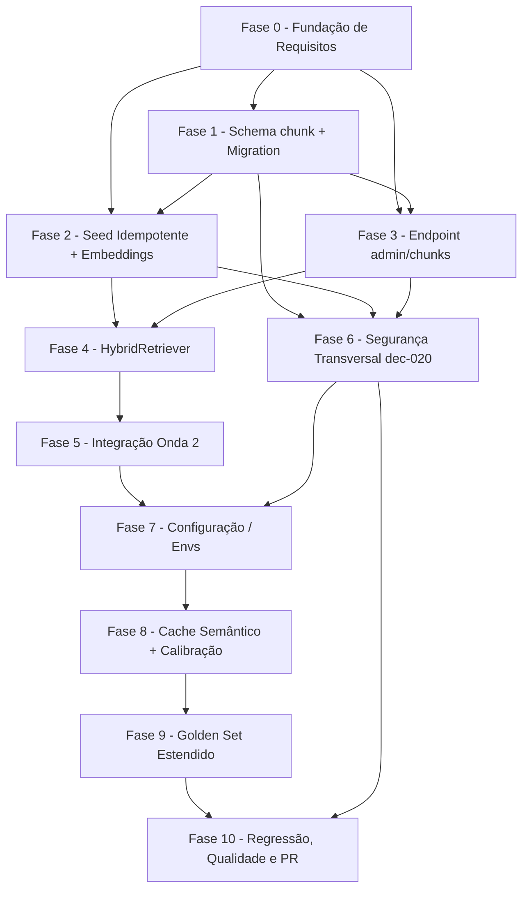

# Tarefas SDR GoldIncision - Recuperação Híbrida Ancorada com Abstenção (Onda 3)

Escopo: decompor `docs/specs/sdr-rag-hibrido/plan.md` + `spec.md` + `data-model.md`
+ `research.md` em tarefas executáveis. Cobre a tabela `chunk` (pgvector +
full-text, FR-007..FR-010, FR-023-INFRA-IDEMP), o `HybridRetriever`
(FR-001..FR-006, FR-013, FR-021), a integração com a Onda 2
(FR-011, FR-012, FR-014, FR-015, FR-018), a configuração (FR-020) e a
preservação integral das Ondas 1 e 2 (FR-016, FR-017). Incorpora como tasks
obrigatórias os 2 findings MEDIUM do gate `owasp-security` (dec-020 #1 API3
BOPLA em `/admin/chunks`, #2 API4/LLM10 Unbounded Consumption) e trata a
pré-condição de infraestrutura do pgvector (dec-013, FR-024-INFRA-PRECONDITION)
como nota obrigatória do corpo do PR — nunca como task de código.

**Legenda de status:**
- `[ ]` Pendente
- `[~]` Em andamento
- `[x]` Concluido
- `[!]` Bloqueado

**Legenda de criticidade:**
- `[C]` Critico - Impacto financeiro direto ou bloqueante
- `[A]` Alto - Funcionalidade essencial
- `[M]` Medio - Necessario mas sem urgencia imediata

---

## FASE 0 - Fundação de Requisitos (Gaps do Checklist)

### 0.1 Resolver gaps abertos do checklist de qualidade de requisitos `[M]`

Ref: `checklists/requirements.md` CHK008, CHK014, CHK023 (itens `{humano}` em aberto)

- [x] 0.1.1 Decidir com o dono do produto o mecanismo concreto de calibração do `RAG_LIMIAR_ABSTENCAO` (quem revisa, com que frequência, contra qual conjunto) (Ref: CHK008, FR-022/US4) <!-- resolvido: documentado como processo interino em checklists/requirements.md CHK008 -->
- [x] 0.1.2 Justificar com dado empírico (ou documentar como ponto de partida arbitrário sujeito a calibração futura junto do limiar) o peso `score_combinado = 0.6*vetorial + 0.4*textual` (Ref: CHK014, `research.md` Decision 4) <!-- resolvido: documentado como ponto de partida arbitrário em checklists/requirements.md CHK014 -->
- [x] 0.1.3 Definir a metodologia/fonte concreta de medição da "linha de base" citada em SC-004 antes da execução do golden set (Ref: CHK023, mesmo gap identificado em CHK022 da Onda 2) <!-- resolvido: documentado como metodologia interina em checklists/requirements.md CHK023 -->

---

## FASE 1 - Schema `chunk` + Migration pgvector-tolerante

### 1.1 Modelo `Chunk` (SQLAlchemy) `[C]`

Ref: Spec FR-007, FR-008; `data-model.md` §1; `plan.md` `app/repository/models.py`

- [x] 1.1.1 Criar classe `Chunk(Base)` em `app/repository/models.py` com colunas `id`, `curso_id` (FK nullable), `tipo`, `idioma`, `conteudo`, `fonte_tabela`, `fonte_id`, `embedding` (`Vector(1536)`, nullable), `ativo`, `criado_em`, `atualizado_em`
- [x] 1.1.2 Aplicar `UniqueConstraint(fonte_tabela, fonte_id, idioma)` + `CheckConstraint` `tipo IN ('objecao','faq','base')` + `idioma IN ('pt','en','es')`
- [x] 1.1.3 Escrever teste unitário validando as constraints (unique violada rejeita; `tipo`/`idioma` inválido rejeita) <!-- tests/test_chunk_model.py, SQLite em memoria (sem Postgres real) -->

### 1.2 Migration Alembic tolerante a pgvector ausente `[C]`

Ref: Spec FR-024-INFRA-PRECONDITION; `research.md` Decision 0; `data-model.md` §1

- [x] 1.2.1 Criar `migrations/versions/<rev>_add_chunk_pgvector.py` com `op.execute("CREATE EXTENSION IF NOT EXISTS vector")` tolerante a falha (não interrompe o `upgrade` se a extensão ainda não puder ser criada, antes do swap de imagem do Postgres) <!-- migrations/versions/e5f6a7b8c9d0_add_chunk_pgvector.py -->
- [x] 1.2.2 Criar tabela `chunk` + coluna gerada `search_vector` (`tsvector` STORED, `CASE` por idioma pt/en/es)
- [x] 1.2.3 Criar os 3 índices: HNSW (`embedding`, `vector_cosine_ops`, `m=16`/`ef_construction=64`), GIN (`search_vector`), composto (`curso_id, idioma, ativo`)
- [x] 1.2.4 Adicionar `"pgvector>=0.3.0"` (ou versão estável mais recente disponível) ao `pyproject.toml` — pin de versão explícito (dec-020 finding #3, LOW, A03 Supply Chain Failures)
- [x] 1.2.5 Escrever teste de migration: `upgrade`/`downgrade` limpos; simular Postgres sem a extensão `vector` disponível e confirmar que o restante do `alembic upgrade head` não quebra (mesmo padrão try/except de `app/main.py:102-118`) <!-- tests/test_migration_chunk.py -->

---

## FASE 2 - Sincronização Idempotente + Embeddings (rag_seed)

### 2.1 `OpenAIClient.embed()` `[A]`

Ref: `plan.md` `app/integrations/openai_client.py`; Spec FR-009; `data-model.md` §4 (`RAG_EMBEDDING_MODEL`)

- [ ] 2.1.1 Implementar `OpenAIClient.embed(textos: list[str]) -> list[list[float]]` usando `RAG_EMBEDDING_MODEL` (default `text-embedding-3-small`, 1536 dims)
- [ ] 2.1.2 Escrever teste unitário (mock do client OpenAI) confirmando shape/dimensão do retorno

### 2.2 `rag_seed.py` — sincronização idempotente `[C]`

Ref: Spec FR-009, FR-010, FR-023-INFRA-IDEMP; `research.md` Decision 9; `data-model.md` §1

- [ ] 2.2.1 Criar `app/rag_seed.py` com upsert condicional (`ON CONFLICT (fonte_tabela, fonte_id, idioma) DO UPDATE ... WHERE conteudo IS DISTINCT FROM`)
- [ ] 2.2.2 Sincronizar `CursoObjecao` → `chunk` (`tipo='objecao'`)
- [ ] 2.2.3 Sincronizar `Faq` → `chunk` (`tipo='faq'`)
- [ ] 2.2.4 Enviar embeddings em lotes de no máximo 100 textos por chamada a `OpenAIClient.embed()` (dec-020 finding #2, API4/LLM10 Unbounded Consumption, `checklists/requirements.md` CHK035)
- [ ] 2.2.5 Tornar a chamada ao `rag_seed` no startup não-fatal quando a extensão `vector`/tabela `chunk` ainda não existir (mesmo padrão try/except de `app/main.py:102-118`, `research.md` Decision 0)
- [ ] 2.2.6 Escrever teste de idempotência: 2ª execução não duplica linhas nem reembeda conteúdo inalterado
- [ ] 2.2.7 Escrever teste confirmando o particionamento em lotes ≤100 para um conjunto grande (>100) de chunks pendentes de embedding (dec-020 finding #2)
- [ ] 2.2.8 Escrever teste de tolerância pré-swap: extensão/tabela ausente não derruba o boot do app

---

## FASE 3 - Endpoint `/admin/chunks` (curadoria + segurança BOPLA)

### 3.1 Endpoint `POST/GET/DELETE /admin/chunks` `[C]`

Ref: Spec FR-007 (`tipo='base'`); `plan.md` `app/api/admin.py`; dec-020 finding #1 (API3 BOPLA), `checklists/requirements.md` CHK034

- [ ] 3.1.1 Criar rotas em `app/api/admin.py` protegidas por `Depends(verify_admin_token)` (mesmo guard de `admin.py:354` e demais endpoints `/admin`)
- [ ] 3.1.2 Schema Pydantic do `POST` aceita SOMENTE `{curso_id, tipo, idioma, conteudo}`; `conteudo` com `max_length=4000` (dec-020 finding #2, CHK035)
- [ ] 3.1.3 Restringir `tipo` a `'base'` server-side — 422 quando `objecao`/`faq` for enviado (dec-020 finding #1)
- [ ] 3.1.4 Servidor sempre grava `fonte_tabela='admin'` e `fonte_id=<id autoincrementado do próprio chunk>` — `fonte_tabela`/`fonte_id`/`embedding`/`ativo` NUNCA aceitos do corpo da requisição, mesmo se enviados (dec-020 finding #1)
- [ ] 3.1.5 `GET /admin/chunks` lista chunks `tipo='base'`; `DELETE /admin/chunks/{id}` remove por id (restrito a `tipo='base'`)
- [ ] 3.1.6 Escrever teste: payload malicioso com `fonte_tabela='faq'` + `fonte_id=<id real de Faq existente>` não sequestra a linha auto-sincronizada (constraint `UNIQUE` preservada, campo ignorado)
- [ ] 3.1.7 Escrever teste: tentativa de `tipo='objecao'`/`'faq'` via `/admin/chunks` retorna 422
- [ ] 3.1.8 Escrever teste: `conteudo` >4000 caracteres retorna 422 (dec-020 finding #2)

---

## FASE 4 - HybridRetriever (Pipeline de Recuperação Híbrida)

### 4.1 Pré-filtro produto + idioma `[C]`

Ref: Spec FR-002; `data-model.md` §2; `plan.md` `app/core/retrieval.py`

- [ ] 4.1.1 Implementar `HybridRetriever.buscar()` em `app/core/retrieval.py` com cláusula `WHERE (curso_id = :curso_id OR curso_id IS NULL) AND idioma = :idioma AND ativo` aplicada ANTES de qualquer ranqueamento
- [ ] 4.1.2 Escrever teste confirmando que chunk de outro produto NUNCA aparece como candidato, mesmo com score alto

### 4.2 Busca vetorial + textual + fusão RRF `[C]`

Ref: Spec FR-001, FR-003, FR-004; `research.md` Decision 4

- [ ] 4.2.1 Busca vetorial `k=RAG_K_VETORIAL` (cosine, índice HNSW)
- [ ] 4.2.2 Busca textual `k=RAG_K_TEXTUAL` (tsquery contra `search_vector`, índice GIN)
- [ ] 4.2.3 Fusão RRF → `score_combinado = 0.6*vetorial + 0.4*textual_normalizado`
- [ ] 4.2.4 Selecionar top-`RAG_TOP_K` por `score_combinado` desc
- [ ] 4.2.5 Escrever teste de ranking (RRF produz a ordem esperada em cenário sintético com overlap parcial vetorial/textual)

### 4.3 Abstenção por limiar, timeout e erro `[C]`

Ref: Spec FR-005, FR-006, FR-021; `research.md` Decision 6/7

- [ ] 4.3.1 `abster=True` quando `chunks` vazio OU `chunks[0].score_combinado < RAG_LIMIAR_ABSTENCAO`
- [ ] 4.3.2 Timeout duro `RAG_RETRIEVAL_TIMEOUT_SECONDS=3.0` → `abster=True, motivo_abstencao="indisponivel"`
- [ ] 4.3.3 Capturar qualquer exceção (extensão/tabela `chunk` inexistente antes do swap) como `abster=True` — nunca propagar erro ao chamador
- [ ] 4.3.4 Escrever teste: timeout == abstenção; erro de DB/extensão ausente == abstenção (simula o cenário pré-swap pgvector)

### 4.4 Reserva de idioma sem fallback cross-idioma `[A]`

Ref: Spec FR-013; `research.md` Decision 11

- [ ] 4.4.1 Pré-filtro por idioma aplicado nas 3 combinações PT/EN/ES
- [ ] 4.4.2 Ausência de chunk equivalente no idioma do lead → abstenção (nunca fallback cross-idioma, diferente do `_load_faq` atual)
- [ ] 4.4.3 Escrever teste cobrindo os 3 idiomas + cenário de ausência total no idioma do lead

---

## FASE 5 - Integração com Onda 2 (rastreabilidade)

### 5.1 Curto-circuito de abstenção nos 3 call-sites de `ETAPA_DUVIDAS` `[C]`

Ref: Spec FR-005, FR-006, FR-015; `plan.md` `app/core/flow.py:1641,1830,2046`

- [ ] 5.1.1 Integrar `HybridRetriever.buscar()` no call-site `flow.py:1641`
- [ ] 5.1.2 Integrar no call-site `flow.py:1830`
- [ ] 5.1.3 Integrar no call-site `flow.py:2046`
- [ ] 5.1.4 `abster=True` → retorno direto `_fallback_indisponivel_response(idioma), True` SEM chamar `GroundedResponder.generate()`
- [ ] 5.1.5 `_load_knowledge_by_slug` monta `knowledge_context` com os chunks recuperados quando `abster=False`; Apresentação/Turmas/Link permanecem verbatim fora do RAG (FR-014)
- [ ] 5.1.6 Escrever teste de integração (FlowEngine real, mock só `OpenAIClient`) cobrindo os 3 call-sites: abstenção curto-circuita sem chamar `generate()`; recuperação bem-sucedida alimenta `knowledge_context`

### 5.2 `GroundedResponder.last_fonte_ids` `[A]`

Ref: Spec FR-011; `data-model.md` §3; `plan.md` `app/core/responder.py`

- [ ] 5.2.1 Adicionar atributo `last_fonte_ids: Optional[list[str]]` ao `GroundedResponder.__init__`
- [ ] 5.2.2 Popular deterministicamente a partir de `chunk.id` dos `chunks_recuperados` passados a `generate()` — NUNCA reportado pelo LLM
- [ ] 5.2.3 Escrever teste: populado corretamente com chunks; `None` quando `chunks_recuperados` vazio/ausente

### 5.3 `FidelityGate` valida as mesmas unidades `[C]`

Ref: Spec FR-012; `plan.md` `app/core/fidelity.py` (sem mudança de assinatura)

- [ ] 5.3.1 Confirmar que `FidelityGate.verificar()` recebe o MESMO `knowledge_context` montado a partir dos chunks recuperados (sem mudança de assinatura)
- [ ] 5.3.2 Escrever teste garantindo que o portão nunca valida contra um conjunto mais amplo/diferente do que efetivamente embasou a resposta

### 5.4 Observabilidade aditiva — `fonte_ids` no `log_turno` `[M]`

Ref: Spec FR-018; `data-model.md` §3; `plan.md` `app/observability/log.py`

- [ ] 5.4.1 Registrar `fonte_ids` em `log_turno` de forma aditiva, junto do `veredito_fidelidade` (Onda 2)
- [ ] 5.4.2 Escrever teste confirmando que o campo novo é aditivo e não quebra parsing/consumo já existente do `log_turno`

---

## FASE 6 - Segurança Transversal (findings dec-020 consolidados)

### 6.1 Regressão consolidada dos 2 findings MEDIUM (dec-020) `[C]`

Ref: dec-020 (#1 API3 BOPLA, #2 API4/LLM10 Unbounded Consumption); `checklists/requirements.md` CHK034, CHK035

- [ ] 6.1.1 Rodar suíte cobrindo simultaneamente: rejeição de `fonte_tabela`/`fonte_id`/`embedding`/`ativo` client-supplied em `/admin/chunks` (task 3.1.4/3.1.6), rejeição de `tipo` fora de `base` (task 3.1.3/3.1.7), rejeição de `conteudo` >4000 chars (task 3.1.2/3.1.8), particionamento de embeddings em lotes ≤100 (task 2.2.4/2.2.7)
- [ ] 6.1.2 Confirmar no relatório de execução que nenhum dos 2 findings MEDIUM do gate `owasp-security` (dec-020) permanece sem teste automatizado cobrindo a mitigação

### 6.2 Confirmar pin de versão pgvector `[M]`

Ref: dec-020 finding #3 (LOW, A03 Supply Chain Failures)

- [ ] 6.2.1 Confirmar `"pgvector>=0.3.0"` (task 1.2.4) pinado em `pyproject.toml`, mesmo padrão de `"sqlalchemy[asyncio]>=2.0.36"`
- [ ] 6.2.2 Rodar `pip list`/checar lockfile e confirmar ausência de instalação "latest" implícita

---

## FASE 7 - Configuração / Envs Novos

### 7.1 Declarar 7 envs novos sem hardcode `[M]`

Ref: `plan.md` Envs novos; `data-model.md` §4; Spec FR-020

- [ ] 7.1.1 Adicionar os 7 campos em `app/config.py` (`Settings`): `rag_embedding_model`, `rag_limiar_abstencao`, `rag_k_vetorial`, `rag_k_textual`, `rag_top_k`, `rag_retrieval_timeout_seconds`, `rag_cache_enabled`
- [ ] 7.1.2 Adicionar as 7 envs em `stack.yml` (serviço `sdr-whatsapp`) e `.env.example`, com os defaults de `plan.md`/`data-model.md`
- [ ] 7.1.3 Escrever teste de config validando defaults + override via env para os 7 novos campos

---

## FASE 8 - Cache Semântico Opcional + Suporte à Calibração

### 8.1 Cache semântico opcional (`RAG_CACHE_ENABLED`, SHOULD) `[M]`

Ref: Spec FR-019; `research.md` Decision 5

- [ ] 8.1.1 Implementar reaproveitamento do resultado de busca (Redis) para pergunta idêntica/muito semelhante dentro da mesma conversa, desligado por padrão (`RAG_CACHE_ENABLED=false`)
- [ ] 8.1.2 Escrever teste confirmando que o cache é opcional (desligado por padrão não altera comportamento) e reduz chamadas repetidas quando ligado

### 8.2 Suporte à revisão de amostras (US4/FR-022) `[M]`

Ref: Spec FR-022; `plan.md` Consulta direta aos registros (Q4/resolvida)

- [ ] 8.2.1 Confirmar que `fonte_ids` + `abster`/`motivo_abstencao` logados em `log_turno` (task 5.4.1) são suficientes para consulta direta ao banco/logs, sem endpoint admin novo
- [ ] 8.2.2 Documentar no corpo do PR (task 10.3) a consulta de exemplo usada para revisar uma amostra de turnos passados

---

## FASE 9 - Golden Set Estendido (groundedness + abstenção)

### 9.1 Estender golden set com casos de RAG `[M]`

Ref: `plan.md` Estratégia de testes; Spec US1/US2 Independent Test

- [ ] 9.1.1 Adicionar casos `@pytest.mark.golden` em `tests/golden/` cobrindo resposta ancorada em chunk específico (groundedness, US1)
- [ ] 9.1.2 Adicionar casos de abstenção (pergunta fora de escopo da base, sem fonte suficiente, US2)
- [ ] 9.1.3 Confirmar que o golden set estendido roda fora do CI padrão (mesmo marcador dedicado já existente)

---

## FASE 10 - Regressão, Qualidade e Entrega (PR)

### 10.1 Suíte de regressão das Ondas 1 e 2 permanece intacta `[C]`

Ref: Spec FR-016, FR-017; `plan.md` Preservação Ondas 1+2

- [ ] 10.1.1 Rodar suíte completa confirmando que anti-loop `_MAX_TENTATIVAS=3`, `max_msgs_per_turn=4`, `_Pacer`+429, idempotência, lock, gate IA=77, `debounce_seconds=8` (Onda 1) permanecem intactos
- [ ] 10.1.2 Rodar suíte confirmando que contrato JSON `RespostaEstruturada`, `FidelityGate`, `SlotExtractor` (Onda 2) permanecem intactos, sem fusão com os novos mecanismos
- [ ] 10.1.3 Escrever/rodar teste de regressão dedicado confirmando 100% de cobertura aprovada das suítes das Ondas 1 e 2

### 10.2 Qualidade final (suíte verde + lint) `[A]`

Ref: `plan.md` Estratégia de testes (RESTRIÇÃO INVIOLÁVEL)

- [ ] 10.2.1 Rodar a suíte completa (unit + integração, FlowEngine real, mock só `OpenAIClient`/`embed()`) e confirmar 100% verde
- [ ] 10.2.2 Rodar `ruff` e corrigir todos os achados até lint limpo
- [ ] 10.2.3 Rodar `validate-tasks-template.sh` e `validate-docs-rendered` sobre este `tasks.md` e demais artefatos gerados

### 10.3 Abertura de PR (sem merge) — inclui pré-condição pgvector `[A]`

Ref: `plan.md` §Pré-condição de merge/deploy (dec-013, FR-024-INFRA-PRECONDITION); RESTRIÇÕES INVIOLÁVEIS

- [ ] 10.3.1 Commitar todas as mudanças na branch `feature/sdr-rag-hibrido`
- [ ] 10.3.2 Abrir PR contra `master` (protegido) com resumo do escopo (RAG híbrido, tabela `chunk`, `HybridRetriever`, rastreabilidade) — NÃO mergear
- [ ] 10.3.3 Reproduzir no corpo do PR a seção "⚠️ Pré-condição de merge/deploy" do `plan.md` NA ÍNTEGRA: trocar a imagem do serviço `postgres` em `stack.yml` de `postgres:16-alpine` para `pgvector/pgvector:pg16`, redeploy SOMENTE desse serviço (`sdr-whatsapp_postgres`), executado pelo operador na janela de infraestrutura dele — NENHUM outro serviço/stack (`fia`, `n8n`, `pgadmin`, `postgres_postgres`, `envio-massa`, `fast-api`, `portainer`, `traefik`, `metanoia`) tocado
- [ ] 10.3.4 Vincular o PR à spec/plan/data-model/checklist/tasks desta feature na descrição

---

## Matriz de Dependencias

## Resumo Quantitativo

| Fase | Tarefas | Subtarefas | Criticidade |
|------|---------|------------|-------------|
| 0 - Fundação de Requisitos | 1 | 3 | M |
| 1 - Schema chunk + Migration | 2 | 8 | C |
| 2 - Seed Idempotente + Embeddings | 2 | 10 | A/C |
| 3 - Endpoint admin/chunks | 1 | 8 | C |
| 4 - HybridRetriever | 4 | 14 | C/A |
| 5 - Integração Onda 2 | 4 | 13 | A/C/M |
| 6 - Segurança Transversal dec-020 | 2 | 4 | C/M |
| 7 - Configuração / Envs | 1 | 3 | M |
| 8 - Cache Semântico + Calibração | 2 | 4 | M |
| 9 - Golden Set Estendido | 1 | 3 | M |
| 10 - Regressão, Qualidade e PR | 3 | 10 | C/A |
| **Total** | **23** | **80** | - |

## Escopo Coberto

| Item | Descricao | Fase |
|------|-----------|------|
| Tabela `chunk` (pgvector + full-text) | Migration tolerante ao pgvector ausente, índices HNSW/GIN | 1 |
| Sincronização idempotente | Upsert condicional de `CursoObjecao`/`Faq`, embeddings em lote | 2 |
| Curadoria admin (`tipo='base'`) | Endpoint `/admin/chunks` com guard existente + restrição BOPLA | 3 |
| Pipeline de recuperação híbrida | Pré-filtro, vetorial+textual, RRF, top-5, abstenção por limiar/timeout/erro | 4 |
| Integração com Onda 2 | 3 call-sites de `ETAPA_DUVIDAS`, `last_fonte_ids`, `FidelityGate`, `log_turno` | 5 |
| Findings OWASP MEDIUM (dec-020) | BOPLA em `/admin/chunks` (#1) e limite de tamanho/lote (#2) — regressão consolidada | 3, 6 |
| Pin de versão pgvector (dec-020 #3) | `pyproject.toml` | 1, 6 |
| Config | 7 envs novos sem hardcode | 7 |
| Cache semântico opcional | `RAG_CACHE_ENABLED`, desligado por padrão | 8 |
| Golden set | Casos de groundedness e abstenção, fora do CI padrão | 9 |
| Regressão + entrega | Ondas 1/2 intactas, lint limpo, PR com pré-condição pgvector documentada | 10 |

## Escopo Excluido

| Item | Descricao | Motivo |
|------|-----------|--------|
| Swap da imagem do serviço `postgres` (`stack.yml` → `pgvector/pgvector:pg16`) | Aplicar/redeployar o serviço `sdr-whatsapp_postgres` na infraestrutura | Ação do OPERADOR na janela de infraestrutura dele — nunca automatizada por esta feature (FR-024-INFRA-PRECONDITION, dec-013); documentada como pré-condição no PR (task 10.3.3), não como task de código |
| Endpoint admin novo para revisão de amostras (US4) | Interface dedicada para calibrar `RAG_LIMIAR_ABSTENCAO` | Q4/resolvida — consulta direta a banco/logs é suficiente (FR-022) |
| Curadoria automática de "seção de base" por heurística | Chunking automático de documentos de base sem revisão humana | Curadoria explícita via `/admin/chunks` é a via concreta definida (Clarifications Q2) |
| Reaproveitamento amplo por resposta final (além de por consulta) | Cache semântico cobrindo toda a resposta, não só o resultado de busca | FR-019 é SHOULD; escopo mínimo (cache por consulta) é suficiente nesta entrega |
| Alteração de qualquer outro serviço/stack (`fia`, `n8n`, `pgadmin`, `postgres_postgres`, `envio-massa`, `fast-api`, `portainer`, `traefik`, `metanoia`) | Qualquer mudança fora do escopo de `sdr-whatsapp_postgres` | RESTRIÇÃO INVIOLÁVEL explícita (FR-024-INFRA-PRECONDITION) |
