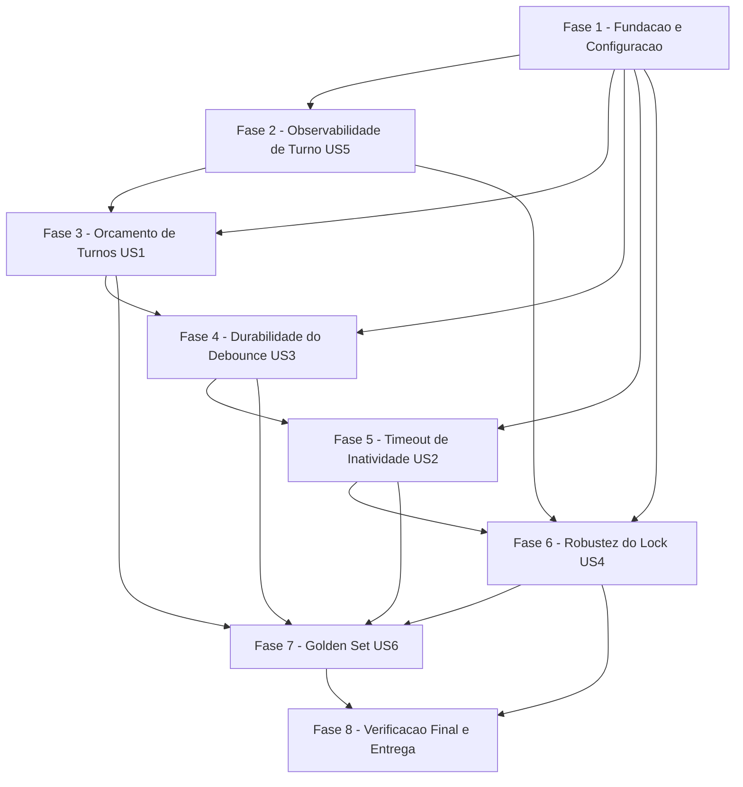

# Tarefas Agente SDR GoldIncision - Controle de Turnos Robusto e Observabilidade de Turno

Escopo: fechar os gaps G1–G6 de controle de turnos (Pilar 7) e tornar cada
turno observável (Pilar 8), **sem migration** e **sem refazer** nenhum
mecanismo já existente (anti-loop `_MAX_TENTATIVAS=3`, `max_msgs_per_turn=4`,
Pacer/retry 429, idempotência SET NX EX, lock SET NX PX, gate de fila IA=77,
debounce 8s). Fonte: `spec.md`, `plan.md`, `research.md`, `data-model.md`,
`contracts/*.md`, `checklists/requirements.md`.

**Legenda de status:**
- `[ ]` Pendente
- `[~]` Em andamento
- `[x]` Concluido
- `[!]` Bloqueado

**Legenda de criticidade:**
- `[C]` Critico - Impacto financeiro direto ou bloqueante (segurança/handoff/preservação de perfil)
- `[A]` Alto - Funcionalidade essencial do gap fechado
- `[M]` Medio - Necessario mas sem urgencia imediata (golden set, decisão de threshold)

---

## FASE 1 - Fundação e Configuração

### 1.1 Variáveis de configuração via pydantic-settings `[A]`

Ref: Spec FR-007, FR-INFRA-01, FR-013; data-model.md §Limiares;
research.md Decision 1, Decision 4

- [x] 1.1.1 Adicionar `MAX_TURNOS_NO_NO` (default 6), `MAX_TURNOS_SESSAO`
  (default 25), `MAX_TURNOS_DUVIDAS` (default 12) em `app/config.py`
- [x] 1.1.2 Adicionar `REENGAJAMENTO_HORAS` (default 24),
  `EXPIRA_SESSAO_HORAS` (default 72) em `app/config.py`
- [x] 1.1.3 Elevar `LOCK_TTL_MS` para default 90000 (env-driven) em
  `app/config.py` e `app/core/redis_keys.py`
- [x] 1.1.4 Atualizar `.env.example` com os novos envs e valores default
  documentados
- [x] 1.1.5 Atualizar `stack.yml` (Docker Swarm) com os novos envs
- [x] 1.1.6 Escrever teste unitário validando que a config carrega os
  defaults corretos e aceita override via env

### 1.2 Fechar gap de checklist CHK011 — limiar de aceitação do golden set `[M]`

Ref: checklists/requirements.md CHK011 (Gap: SC-008 não define patamar
mínimo de taxa de acerto)

- [x] 1.2.1 Decidir com o dono do produto: golden set informativo (sem
  threshold bloqueante nesta rodada) ou threshold mínimo por dimensão —
  default conservador se decisão indisponível: **informativo** (não
  bloqueia CI, conforme spec.md já prevê suíte separada instável)
- [x] 1.2.2 Documentar a decisão em `research.md` (nova "Decision 9") ou
  nota equivalente em `quickstart.md`
- [x] 1.2.3 Se a decisão alterar a redação de SC-008, atualizar `spec.md`
  com nota de esclarecimento (clarificação, não mudança de escopo)

### 1.3 Fechar gap de checklist CHK006 — anti-PII como teste dedicado `[A]`

Ref: checklists/requirements.md CHK006 (Gap: restrição anti-PII só em
research.md Decision 8, não testada dedicadamente); Spec FR-020, SEC-LLM-1

- [x] 1.3.1 Escrever teste dedicado garantindo que `log_turno` nunca
  inclui conteúdo bruto da mensagem do lead
- [x] 1.3.2 Escrever teste dedicado garantindo mascaramento de
  número/telefone via `_mask_number` no evento de turno
- [x] 1.3.3 Escrever teste dedicado garantindo que `_scrub` remove chaves
  sensíveis (tokens/keys) do evento de turno antes de `_emit`

---

## FASE 2 - Observabilidade de Turno (US5)

### 2.1 Implementar `log_turno` em `observability/log.py` `[A]`

Ref: Spec FR-015, FR-016; plan.md Decision 5; data-model.md §Entity
Registro de Turno; contracts/turno-event.md

- [x] 2.1.1 Definir `log_turno(...)` reusando `_emit`/`_scrub`/`_mask_number`
  já existentes
- [x] 2.1.2 Implementar todos os 12 campos do evento: `event`,
  `chamado_id`, `turno_sessao`, `etapa_entrada`, `etapa_saida`,
  `intencao`, `idioma`, `n_blocos_enviados`, `acao`, `handoff_destino`,
  `duracao_ms`, `tentativas`, `motivo`
- [x] 2.1.3 Medir `duracao_ms` com relógio monotônico em torno do
  processamento do turno
- [x] 2.1.4 Escrever teste de shape/contrato do evento em
  `test_observability.py` (todos os campos obrigatórios presentes,
  enum `acao` respeitado)

### 2.2 Emitir evento em `_process_consolidated_messages` com try/finally `[A]`

Ref: Spec FR-015, FR-016, SC-007; Edge Cases (turno que falha antes de
completar)

- [x] 2.2.1 Envolver o processamento do turno em bloco `try/finally` em
  `app/api/webhook.py` (aplicado em `_handle_engine`, que concentra o
  processamento real de 1 turno; `_process_consolidated_messages` apenas
  adquire o lock e delega — local mais preciso para o try/finally)
- [x] 2.2.2 No caminho de sucesso, popular `acao`
  (`resposta`\|`nudge`\|`handoff`\|`retomada`\|`sessao_nova`) e emitir
  `log_turno` (nesta fase: `resposta`\|`handoff`, os unicos alcancaveis
  antes de FASE 3/5 implementarem nudge/retomada/sessao_nova)
- [x] 2.2.3 No caminho de falha (exceção não tratada), emitir evento
  parcial com `acao="erro"` e os campos disponíveis até o ponto de falha
- [x] 2.2.4 Escrever teste garantindo exatamente 1 evento por turno,
  inclusive em falha simulada (implementado em `test_integration_e2e.py`,
  junto da classe `TestF8WebhookEngineWired` que já exercita
  `_handle_engine` real — mais coerente que duplicar o setup em
  `test_webhook.py`, SC-007)

---

## FASE 3 - Orçamento de Turnos: Contadores e Escalonamento (US1)

### 3.1 Contadores `turnos_sessao` / `turnos_no_no` em Redis `[A]`

Ref: Spec FR-001, FR-002; research.md Decision 1, Decision 2, Decision 3;
data-model.md §Entity Contadores de sessão

- [ ] 3.1.1 Adicionar campos `turnos_sessao`/`turnos_no_no:{etapa}` em
  `app/core/redis_keys.py` (hash `estado:{chamadoId}`)
- [ ] 3.1.2 Incrementar via `HINCRBY` exatamente 1x por turno em
  `_process_consolidated_messages`/`engine.process`
- [ ] 3.1.3 Implementar reset do contador por-nó ao detectar mudança de
  `etapa_mapa_mestre`
- [ ] 3.1.4 Implementar fail-open: `HGET` ausente ⇒ tratar como 0 (Edge
  Case: perda de contadores em restart do Redis)
- [ ] 3.1.5 Escrever teste garantindo que o contador de turnos é
  ortogonal ao contador anti-loop `_MAX_TENTATIVAS` — os dois não se
  fundem (Acceptance Scenario 5, US1)
- [ ] 3.1.6 Escrever teste de fail-open (contador ausente não bloqueia o
  atendimento)

### 3.2 Nudge de nó e limiar elevado de dúvidas `[A]`

Ref: Spec FR-003, FR-005, FR-007; `flow.py`, `config.py`

- [ ] 3.2.1 Implementar checagem de `MAX_TURNOS_NO_NO` em `flow.py` e
  injetar nudge cordial i18n (`_T`/`_t`) sem interromper a conversa
- [ ] 3.2.2 Implementar limiar diferenciado `MAX_TURNOS_DUVIDAS` para a
  etapa de dúvidas abertas
- [ ] 3.2.3 Escrever teste: nudge disparado exatamente no teto de nó,
  sem handoff (Acceptance Scenario 2, US1)
- [ ] 3.2.4 Escrever teste: ausência de nudge em dúvidas abaixo do teto
  elevado (Acceptance Scenario 4, US1)

### 3.3 Handoff de sessão com precedência sobre nudge de nó `[C]`

Ref: Spec FR-004, FR-006, FR-020; Edge Cases item 1 (colisão sessão+nó)

- [ ] 3.3.1 Implementar checagem de `MAX_TURNOS_SESSAO` em `flow.py`,
  com `FlowResult.handoff_destino` sempre proveniente da allowlist/config
  (`handoff_queue_ids_json`), nunca do LLM
- [ ] 3.3.2 Implementar precedência: teto de sessão prevalece sobre teto
  de nó/dúvidas quando ambos são atingidos no mesmo turno
- [ ] 3.3.3 Registrar campo `motivo` (`turnos_no_no`\|`turnos_sessao`) no
  `log_turno` ao disparar nudge/handoff (FR-006)
- [ ] 3.3.4 Escrever teste de handoff no teto de sessão com destino
  lógico válido (Acceptance Scenario 3, US1; SC-002)
- [ ] 3.3.5 Escrever teste de colisão simultânea teto-sessão + teto-nó
  ⇒ handoff de sessão prevalece (Edge Case item 1)
- [ ] 3.3.6 Escrever teste garantindo que `handoff_destino` nunca é
  decidido pelo LLM (assert contra allowlist estática, não contra saída
  do modelo)

---

## FASE 4 - Durabilidade do Debounce em Restart (US3)

### 4.1 Recovery de agrupamento pendente no lifespan de startup `[A]`

Ref: Spec FR-011, FR-012; research.md Decision 6; `main.py`, `debounce.py`

- [ ] 4.1.1 Implementar `SCAN debounce:*` no lifespan de `app/main.py`
  após conectar o Redis
- [ ] 4.1.2 Implementar helper de recovery em `debounce.py`: reagendar
  `_delayed_flush` se a janela de 8s ainda não expirou, flush imediato
  caso contrário (estratégia conservadora)
- [ ] 4.1.3 Garantir que o flush é atômico (`LRANGE`+`DEL`) e idempotente
  mesmo se o recovery rodar mais de uma vez
- [ ] 4.1.4 Verificar interação com o gate de fila existente (IA=77):
  atendimento sob controle humano não gera resposta do bot na rajada
  recuperada (Edge Case item 5)
- [ ] 4.1.5 Escrever teste: rajada pendente processada automaticamente
  no restart, sem exigir nova mensagem do lead (Acceptance Scenario 1, US3)
- [ ] 4.1.6 Escrever teste: janela já expirada no momento do restart ⇒
  processamento imediato na inicialização (Acceptance Scenario 2, US3)
- [ ] 4.1.7 Escrever teste: recovery executado mais de uma vez processa
  a rajada exatamente uma vez (Acceptance Scenario 3, US3; FR-012)

---

## FASE 5 - Timeout de Inatividade e Reengajamento (US2)

### 5.1 Marca de última interação `[A]`

Ref: Spec FR-008; data-model.md `ultima_interacao`; research.md Decision 8

- [ ] 5.1.1 Implementar `HSET ultima_interacao <epoch>` a cada turno
  processado
- [ ] 5.1.2 Implementar fail-open: leitura ausente/corrompida do
  timestamp ⇒ tratar como interação recente (não dispara
  retomada/expiração espúria)
- [ ] 5.1.3 Escrever teste de fail-open de `ultima_interacao`

### 5.2 Retomada cordial por reengajamento `[A]`

Ref: Spec FR-009; Acceptance Scenarios 1 e 3, US2; Edge Cases item 4

- [ ] 5.2.1 Implementar detecção lazy no início de `engine.process`:
  `REENGAJAMENTO_HORAS < delta <= EXPIRA_SESSAO_HORAS` ⇒ retomada
  cordial i18n (`_T`/`_t`), sem reiniciar a jornada nem perder o estado
  corrente
- [ ] 5.2.2 Garantir que etapa/pergunta pendente (ex.: menu) continua
  válida após a retomada, sem reapresentar o menu inteiro (Edge Case
  item 4)
- [ ] 5.2.3 Escrever teste: gap moderado ⇒ retomada sem perda de
  contexto de fluxo (Acceptance Scenario 1, US2; SC-003)
- [ ] 5.2.4 Escrever teste: gap abaixo de ambos os limiares ⇒ nenhuma
  mensagem de retomada emitida, comportamento inalterado (Acceptance
  Scenario 3, US2)

### 5.3 Expiração de sessão preservando perfil do Contato `[C]`

Ref: Spec FR-010; `memory.py`; Acceptance Scenario 2, US2; SC-004;
checklists/requirements.md CHK005

- [ ] 5.3.1 Implementar detecção de `delta > EXPIRA_SESSAO_HORAS` ⇒
  etapa retorna à saudação inicial (sessão tratada como nova)
- [ ] 5.3.2 Garantir preservação de elegibilidade médica, idioma,
  especialidade, experiência e interesse do Contato (`memory.py`) sem
  re-perguntar nenhum dado já capturado — usar `Contato` como única
  fonte da verdade da lista de campos preservados (fecha CHK005)
- [ ] 5.3.3 Escrever teste: expiração de sessão preserva 100% dos campos
  de perfil já capturados (Acceptance Scenario 2, US2; SC-004)
- [ ] 5.3.4 Escrever teste de regressão: nenhuma pergunta de perfil já
  respondido é repetida após expiração de sessão

---

## FASE 6 - Robustez do Lock de Exclusividade (US4)

### 6.1 Elevar TTL do lock com base em dados observados `[M]`

Ref: Spec FR-013, FR-014; research.md Decision 4; `locks.py`,
`redis_keys.py`. Depende dos dados de `duracao_ms` emitidos pela FASE 2.

- [ ] 6.1.1 Elevar `LOCK_TTL_MS` default para 90000 (já configurado via
  1.1.3) e aplicar no mecanismo de lock por atendimento em `locks.py`
- [ ] 6.1.2 Documentar em `research.md`/`plan.md` a confirmação empírica
  do valor de 90s via `duracao_ms` coletado (ou nota de pendência
  explícita se dados de produção ainda não estiverem disponíveis nesta
  rodada — SC-010 valida em produção separadamente)
- [ ] 6.1.3 Documentar como decisão consciente adiada a distribuição do
  pacing entre múltiplas réplicas (FR-014) — sem implementação nesta
  feature
- [ ] 6.1.4 Escrever teste simulando turno de duração próxima ao pior
  caso conhecido (LLM + múltiplos envios + retries), garantindo que o
  lock permanece válido até o fim do processamento (Acceptance
  Scenario 1, US4; SC-006)

---

## FASE 7 - Golden Set de Regressão de Jornada (US6)

### 7.1 Casos de referência (fixtures) `[M]`

Ref: Spec FR-017; research.md Decision 7;
`agente-atendimento-confiavel/padroes-implementacao.md §7`

- [ ] 7.1.1 Criar `tests/golden/casos/*.json` com 30 a 50 casos derivados
  de cenários reais de teste e dos caminhos oficiais da jornada (SC-008)
- [ ] 7.1.2 Cada caso define `mensagem`, `estado_inicial`,
  `esperado.proxima_acao`, `esperado.etapa`, `esperado.nao_repetir_slot`
- [ ] 7.1.3 Incluir casos de abstenção (mensagem fora da Base Oficial de
  Conhecimento) com `esperado.abster=true`
- [ ] 7.1.4 Incluir casos de anti-alucinação de preço com
  `esperado.sem_preco_inventado=true`

### 7.2 Harness de execução do golden set `[M]`

Ref: Spec FR-018; research.md Decision 7; tarefa 1.2 (limiar de aceitação)

- [ ] 7.2.1 Implementar `tests/golden/test_golden_runner.py` usando o
  **FlowEngine REAL** (`StubFlowEngine` stuba só I/O de DB — nunca
  mockar o motor)
- [ ] 7.2.2 Marcar a suíte com `@pytest.mark.golden` e excluir do gate
  de CI padrão (suíte separada, não bloqueia merge se instável)
- [ ] 7.2.3 Implementar relatório de taxa de acerto por dimensão (fluxo
  correto, abstenção correta, ausência de preço inventado)
- [ ] 7.2.4 Aplicar a decisão de limiar de aceitação definida na tarefa
  1.2 (threshold bloqueante ou apenas informativo)
- [ ] 7.2.5 Documentar comando de execução
  (`python3 -m pytest tests/golden -m golden`) em `quickstart.md`/README

---

## FASE 8 - Verificação Final, Preservação e Entrega

### 8.1 Regressão dos mecanismos existentes `[C]`

Ref: Spec FR-019, FR-020, SC-009

- [ ] 8.1.1 Rodar a suíte completa existente (~320 testes) e confirmar
  zero regressão em anti-loop (`_MAX_TENTATIVAS=3`), teto de mensagens
  (`max_msgs_per_turn=4`), Pacer/retry 429, idempotência (`SET NX EX`),
  lock por ticket (exceto TTL elevado por design), gate de fila (IA=77)
  e debounce (8s)
- [ ] 8.1.2 Escrever/atualizar teste explícito de não-regressão para
  cada mecanismo preservado listado em FR-019
- [ ] 8.1.3 Confirmar as invariantes de FR-020 permanecem intactas:
  verbatim nunca gerado pelo LLM, destino de handoff sempre da
  allowlist, elegibilidade médica inflexível, uma pergunta por mensagem,
  resposta no idioma do lead (PT/EN/ES)

### 8.2 Qualidade de código e entrega `[A]`

Ref: Constitution v1.0.0; CLAUDE.md; plan.md §Próximos Passos

- [ ] 8.2.1 Rodar `ruff check app/ tests/` e corrigir todos os achados
- [ ] 8.2.2 Rodar a suíte completa (excluindo `tests/golden`) e confirmar
  100% verde
- [ ] 8.2.3 Abrir PR contra `master` (protegido, CI obrigatório); sem
  deploy automático — deploy fica a cargo do operador
- [ ] 8.2.4 Atualizar `quickstart.md` com eventuais ajustes descobertos
  durante a implementação dos 10 cenários

---

## Matriz de Dependencias

## Resumo Quantitativo

| Fase | Tarefas | Subtarefas | Criticidade |
|------|---------|------------|-------------|
| 1 - Fundação e Configuração | 3 | 12 | A/M/A |
| 2 - Observabilidade de Turno (US5) | 2 | 8 | A/A |
| 3 - Orçamento de Turnos (US1) | 3 | 16 | A/A/C |
| 4 - Durabilidade do Debounce (US3) | 1 | 7 | A |
| 5 - Timeout de Inatividade (US2) | 3 | 11 | A/A/C |
| 6 - Robustez do Lock (US4) | 1 | 4 | M |
| 7 - Golden Set (US6) | 2 | 9 | M/M |
| 8 - Verificação Final e Entrega | 2 | 7 | C/A |
| **Total** | **17** | **74** | - |

## Escopo Coberto

| Item | Descricao | Fase |
|------|-----------|------|
| US1 (FR-001 a FR-007) | Orçamento de turnos: contadores, nudge de nó, limiar de dúvidas, handoff de sessão com precedência | 3 |
| US2 (FR-008 a FR-010, FR-INFRA-01) | Marca de última interação, retomada por reengajamento, expiração preservando perfil | 5 |
| US3 (FR-011, FR-012) | Recovery idempotente de debounce pendente no restart | 4 |
| US4 (FR-013, FR-014) | TTL de lock elevado (justificado por dados de US5); pacing distribuído documentado como adiado | 6 |
| US5 (FR-015, FR-016) | Evento estruturado por turno, inclusive em falha (`acao=erro`) | 2 |
| US6 (FR-017, FR-018) | Golden set de regressão de jornada (30-50 casos), suíte separada | 7 |
| FR-019, FR-020 | Preservação de mecanismos existentes e invariantes de segurança | 8 |
| Envs/config (FR-007, FR-INFRA-01) | `.env.example` + `stack.yml`, sem hardcode | 1 |
| CHK006 (checklist Gap) | Teste dedicado anti-PII/anti-secret no evento de turno | 1 |
| CHK011 (checklist Gap) | Decisão de limiar de aceitação do golden set | 1, 7 |

## Escopo Excluido

| Item | Descricao | Motivo |
|------|-----------|--------|
| Portão de verificação de fidelidade pós-geração (Pilar 5) | Validação semântica de resposta após geração | Fora do escopo da spec (Out of Scope); feature separada futura |
| Contrato JSON de saída do LLM (Pilar 6) | Saída estruturada obrigatória do modelo para fases de dúvida | Fora do escopo da spec (Out of Scope) |
| RAG híbrido / busca vetorial (Pilar 4) | Recuperação vetorial para FAQ/objeções | Fora do escopo da spec (Out of Scope) |
| Distribuição do pacing multi-réplica | Coordenação de `whatsapp_min_interval_ms` entre >1 réplica | Necessário só ao escalar horizontalmente; documentado como pré-condição futura (FR-014), sem implementação (tarefa 6.1.3) |
| Encerramento proativo de sessões abandonadas (worker dedicado) | Processo agendado para varrer sessões inativas | Detecção lazy no retorno do lead (US2) cobre o caso de uso essencial; spec Out of Scope |
| Entidade durável de `Turno` (Postgres) | Tabela histórica de turnos para analytics | Sem migration nesta onda (restrição inviolável); o registro estruturado (US5) é suficiente para o escopo |
| Migration de banco de dados | Qualquer alteração de schema Postgres | Restrição inviolável desta onda — contadores/turno são efêmeros (Redis) ou log (stdout) |
