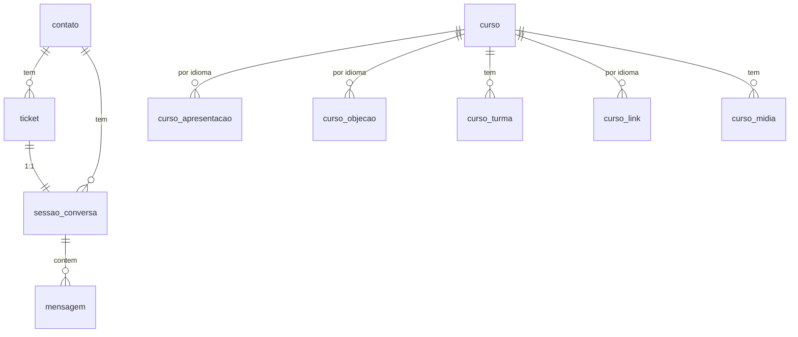

# Data Model — Agente SDR WhatsApp (GoldIncision)

**Feature**: `sdr-whatsapp` | **Fase**: Phase 1 (design)
**Spec**: [spec.md](./spec.md) | **Research**: [research.md](./research.md)

Persistência durável em **PostgreSQL** (catálogo, contatos, histórico, estado de
ticket). Estado volátil/efêmero (debounce, locks, idempotência, janela quente) em
**Redis** (§Estruturas Redis ao final). Convenção: colunas Postgres em
`snake_case`; DTOs da aplicação em `camelCase` (ver §Convenções de Borda no
plan.md). Timestamps em `timestamptz` (UTC).

---

## Entity: Contato (`contato`)

Identidade persistente do lead por número de WhatsApp. Guarda variáveis de
qualificação reutilizadas entre tickets/sessões (FR-020, FR-021).

| Campo | Tipo | Constraints | Notas |
|-------|------|-------------|-------|
| `id` | bigserial | PK | id interno |
| `numero` | text | UNIQUE, NOT NULL | `sender` (DDI+DDD+num), ex. `5511967296849` |
| `contact_id_externo` | bigint | NULL | `ticketData.contact.id` do ChatMaster |
| `nome` | text | NULL | `name` / `contact.name` |
| `idioma` | text | NULL, CHECK in (`pt`,`en`,`es`) | idioma detectado/preferido |
| `eh_medico` | boolean | NULL | elegibilidade médica declarada |
| `especialidade` | text | NULL | especialidade médica informada |
| `experiencia_corporal` | boolean | NULL | true=HG corporal; false=só facial |
| `produto_interesse` | text | NULL | curso/programa em foco |
| `etapa_funil` | text | NULL | etapa corrente do Mapa Mestre |
| `created_at` | timestamptz | NOT NULL default now() | |
| `updated_at` | timestamptz | NOT NULL default now() | |

**Relacionamentos**: 1 contato → N tickets; 1 contato → N sessões de conversa.

**Regras**: variáveis de qualificação só são sobrescritas com nova informação
explícita do lead; nunca apagadas por silêncio (suporta FR-021/SC-002). Mudança
de idioma no meio da conversa atualiza `idioma` (US5-AS5).

---

## Entity: Ticket (`ticket`)

Unidade de atendimento (uma conversa ativa correlacionada a um `chamadoId`).
Estado de fluxo é por ticket; memória de qualificação é por contato (edge case
"múltiplos tickets do mesmo contato").

| Campo | Tipo | Constraints | Notas |
|-------|------|-------------|-------|
| `id` | bigserial | PK | id interno |
| `chamado_id` | bigint | UNIQUE, NOT NULL | `chamadoId` / `ticketData.id` |
| `contato_id` | bigint | FK → contato.id, NOT NULL | |
| `company_id` | bigint | NULL | `companyId` |
| `queue_id` | bigint | NULL | `queueId` de origem |
| `whatsapp_id` | bigint | NULL | `whatsappId` (conexão) |
| `caminho_atual` | smallint | NULL, CHECK 1..6 | caminho do Mapa Mestre |
| `etapa_mapa_mestre` | text | NULL | etapa fina dentro do caminho |
| `status` | text | NOT NULL default `aberto`, CHECK in (`aberto`,`em_handoff`,`encerrado`) | |
| `handoff_motivo` | text | NULL | motivo do handoff (se houver) |
| `handoff_destino` | text | NULL | fila/conexão/Nídia |
| `created_at` | timestamptz | NOT NULL default now() | |
| `updated_at` | timestamptz | NOT NULL default now() | |

**State transitions** (`status`):
```
aberto ── handoff determinado/solicitado ──▶ em_handoff ──▶ (agente não responde mais)
aberto ── fluxo concluído (ex. link enviado) ──▶ encerrado
em_handoff ── (terminal p/ o agente; humano assume) ──▶ encerrado
```
Regra MUST: em `em_handoff` ou `encerrado` o agente NÃO envia mensagens (FR-023,
FR-024, US3-AS5). Antes de processar qualquer webhook, checar `status`.

**Relacionamentos**: N tickets → 1 contato; 1 ticket → 1 sessão de conversa.

---

## Entity: Sessão de Conversa (`sessao_conversa`)

Container do histórico + resumo rolante de um ticket (Princípio III, FR-018,
FR-019).

| Campo | Tipo | Constraints | Notas |
|-------|------|-------------|-------|
| `id` | bigserial | PK | |
| `ticket_id` | bigint | FK → ticket.id, UNIQUE, NOT NULL | 1:1 com ticket |
| `contato_id` | bigint | FK → contato.id, NOT NULL | |
| `resumo_rolante` | text | NULL | síntese rolante (modelo barato) |
| `resumo_tokens` | int | NULL | tamanho aproximado do resumo |
| `ultima_atualizacao_resumo` | timestamptz | NULL | quando re-sintetizado |
| `created_at` | timestamptz | NOT NULL default now() | |

**Relacionamentos**: 1 sessão → N mensagens.

---

## Entity: Mensagem (`mensagem`)

Histórico completo append-only por sessão (FR-018). Inclui inbound (lead) e
outbound (agente).

| Campo | Tipo | Constraints | Notas |
|-------|------|-------------|-------|
| `id` | bigserial | PK | |
| `sessao_id` | bigint | FK → sessao_conversa.id, NOT NULL | |
| `direcao` | text | NOT NULL, CHECK in (`inbound`,`outbound`) | |
| `tipo` | text | NOT NULL, CHECK in (`text`,`audio`,`video`,`image`,`document`) | |
| `conteudo` | text | NULL | texto (ou transcrição de áudio) |
| `media_url` | text | NULL | `mediaUrl`/`remoteUrl` quando mídia |
| `wid` | text | NULL | id externo da mensagem (`wid`/`id`) |
| `transcrito` | boolean | NOT NULL default false | true se conteúdo veio de transcrição |
| `created_at` | timestamptz | NOT NULL default now() | |

**Regras**: append-only (sem update de conteúdo). Janela quente em Redis espelha
as últimas N; a fonte da verdade durável é esta tabela.

---

## Entity: Curso (`curso`)

Item do catálogo gerido pela API de admin (Princípio VII, FR-025/026/027). Cursos
são DADOS.

| Campo | Tipo | Constraints | Notas |
|-------|------|-------------|-------|
| `id` | bigserial | PK | |
| `slug` | text | UNIQUE, NOT NULL | id estável (ex. `curso-online-hg`) |
| `nome` | text | NOT NULL | nome oficial |
| `tipo` | text | NOT NULL, CHECK in (`online`,`presencial`,`licenciamento`,`franquia`) | |
| `caminho_mapa_mestre` | smallint | NULL, CHECK 1..6 | caminho associado |
| `elegibilidade` | jsonb | NOT NULL default `{}` | regras (ex. `{"medico":true,"corporal":true}`) |
| `ativo` | boolean | NOT NULL default true | soft-delete (DELETE = ativo=false) |
| `created_at` | timestamptz | NOT NULL default now() | |
| `updated_at` | timestamptz | NOT NULL default now() | |

**Relacionamentos**: 1 curso → N apresentações (por idioma); → N objeções; → N
turmas; → N links de inscrição (por idioma); → N mídias.

**State**: `ativo=true` ↔ aparece no catálogo do motor (FR-026). `DELETE` faz
soft-delete (`ativo=false`); conversas novas não o mencionam (US4-AS4).

---

## Entity: Apresentação Oficial (`curso_apresentacao`)

Texto oficial verbatim por idioma — enviado na íntegra, nunca reescrito (FR-010,
Princípio II).

| Campo | Tipo | Constraints | Notas |
|-------|------|-------------|-------|
| `id` | bigserial | PK | |
| `curso_id` | bigint | FK → curso.id, NOT NULL | |
| `idioma` | text | NOT NULL, CHECK in (`pt`,`en`,`es`) | |
| `texto` | text | NOT NULL | apresentação verbatim |
| `created_at` | timestamptz | NOT NULL default now() | |

**Constraint**: UNIQUE(`curso_id`,`idioma`).

---

## Entity: Banco de Objeções (`curso_objecao`)

Pares objeção/resposta oficiais por curso e idioma (FR-011, Princípio V).

| Campo | Tipo | Constraints | Notas |
|-------|------|-------------|-------|
| `id` | bigserial | PK | |
| `curso_id` | bigint | FK → curso.id, NOT NULL | |
| `idioma` | text | NOT NULL, CHECK in (`pt`,`en`,`es`) | |
| `objecao` | text | NOT NULL | gatilho da objeção |
| `resposta` | text | NOT NULL | resposta oficial verbatim |
| `created_at` | timestamptz | NOT NULL default now() | |

**Regra**: o motor só responde objeção comercial com entradas desta tabela do
curso em atendimento; nunca improvisa (FR-011).

---

## Entity: Turma (`curso_turma`)

Instância de curso presencial (FR-025, US4-AS3).

| Campo | Tipo | Constraints | Notas |
|-------|------|-------------|-------|
| `id` | bigserial | PK | |
| `curso_id` | bigint | FK → curso.id, NOT NULL | |
| `cidade` | text | NOT NULL | ex. São Paulo, Barcelona |
| `pais` | text | NULL | |
| `data_inicio` | date | NULL | |
| `capacidade` | int | NULL | |
| `vagas_disponiveis` | int | NULL | |
| `lote_preco` | text | NULL | lote vigente |
| `ativo` | boolean | NOT NULL default true | |

---

## Entity: Link de Inscrição (`curso_link`)

Links de inscrição por idioma (US1-AS3, US5-AS4).

| Campo | Tipo | Constraints | Notas |
|-------|------|-------------|-------|
| `id` | bigserial | PK | |
| `curso_id` | bigint | FK → curso.id, NOT NULL | |
| `idioma` | text | NOT NULL, CHECK in (`pt`,`en`,`es`) | |
| `url` | text | NOT NULL | ex. pay.hotmart.com/Q95039051K (EN) |

**Constraint**: UNIQUE(`curso_id`,`idioma`).

---

## Entity: Mídia de Curso (`curso_midia`)

Mídias associadas (imagem/áudio/vídeo/documento) enviáveis por URL (FR-017).

| Campo | Tipo | Constraints | Notas |
|-------|------|-------------|-------|
| `id` | bigserial | PK | |
| `curso_id` | bigint | FK → curso.id, NOT NULL | |
| `idioma` | text | NULL, CHECK in (`pt`,`en`,`es`) | NULL = todos |
| `tipo` | text | NOT NULL, CHECK in (`image`,`audio`,`video`,`document`) | |
| `url` | text | NOT NULL | URL pública da mídia |
| `legenda` | text | NULL | |

---

## Entity: Evento de Observabilidade (`evento_log`)

Persistência opcional de eventos estruturados além do log stdout (FR-033,
FR-034). Log JSON em stdout é a fonte primária; esta tabela é índice consultável
para métricas (US7).

| Campo | Tipo | Constraints | Notas |
|-------|------|-------------|-------|
| `id` | bigserial | PK | |
| `ticket_id` | bigint | NULL | correlação |
| `contact_number` | text | NULL | |
| `tipo` | text | NOT NULL | `webhook_in`,`llm_call`,`message_out`,`handoff`,`erro` |
| `stage` | text | NULL | etapa do Mapa Mestre |
| `model_used` | text | NULL | só p/ `llm_call` |
| `tokens_in` | int | NULL | |
| `tokens_out` | int | NULL | |
| `latency_ms` | int | NULL | |
| `detalhe` | jsonb | NULL | payload adicional (sem secrets) |
| `created_at` | timestamptz | NOT NULL default now() | |

---

## Estruturas Redis (efêmeras — não duráveis)

| Chave | Tipo | TTL | Propósito | FR |
|-------|------|-----|-----------|-----|
| `idemp:{chamadoId}:{sha256(conteudo)}` | string | 24h | idempotência de evento | FR-037 |
| `debounce:{chamadoId}` | list | janela (8s) | buffer de rajada consolidada | FR-003 |
| `lock:ticket:{chamadoId}` | string (SET NX PX) | ~30s | serialização por ticket | FR-035 |
| `sessao:{chamadoId}:hot` | list | sessão | janela quente (últimas N msgs) | FR-019 |
| `estado:{chamadoId}` | hash | sessão | etapa/variáveis em cache quente | FR-020 |

**Regra de durabilidade**: nada exclusivo no Redis. Redis acelera o caminho
quente; a fonte da verdade durável é sempre Postgres (recuperável após restart).

---

## Diagrama de relacionamentos



## Seed inicial (FR-027)

Script idempotente popula 6 cursos a partir de `knowledge_base/documentos_agente/`
(texto verbatim extraído uma vez): Curso Online de HG, HG Módulo 1, HG360 São
Paulo, HG360 Barcelona, Licenciamento Internacional, Franquia GoldIncision — com
apresentações (PT/EN/ES quando disponível), bancos de objeções, elegibilidade,
turmas e links. Re-execução não duplica (upsert por `slug`).
