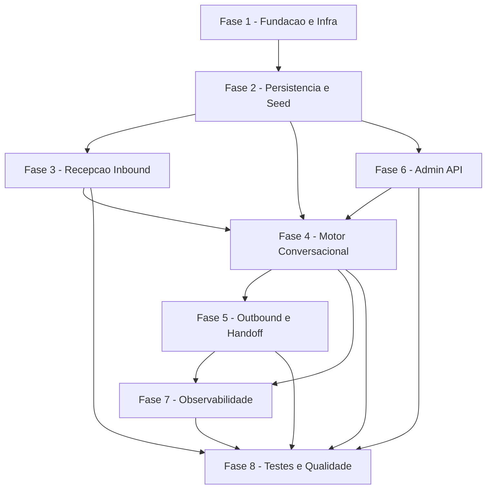

# Tarefas sdr-whatsapp - Agente SDR Consultivo via WhatsApp (GoldIncision)

Escopo: Backlog tecnico para o Consultor Virtual Oficial da GoldIncision —
servico FastAPI que recebe webhook do ChatMaster (via n8n, por overlay interna),
conduz o lead pelo Mapa Mestre com anti-alucinacao rigida, responde pela API do
ChatMaster, persiste memoria (Postgres+Redis proprios), expoe admin CRUD de
cursos por token, e e empacotado como stack Docker Swarm autocontida ate
build+push no registry interno (sem `docker stack deploy` live).

**Legenda de status:**
- `[ ]` Pendente
- `[~]` Em andamento
- `[x]` Concluido
- `[!]` Bloqueado

**Legenda de criticidade:**
- `[C]` Critico - Impacto financeiro direto ou bloqueante
- `[A]` Alto - Funcionalidade essencial
- `[M]` Medio - Necessario mas sem urgencia imediata

---

## FASE 1 - Fundacao e Infraestrutura

### 1.1 Setup do projeto Python/FastAPI `[A]`

Ref: plan.md §Project Structure; research.md Decisoes 1/3/4

- [x] 1.1.1 Criar `pyproject.toml` (Python 3.12; FastAPI, Uvicorn, Pydantic v2, SQLAlchemy 2.0 async + asyncpg, Alembic, redis.asyncio, openai, httpx)
- [x] 1.1.2 Criar estrutura `app/` (`main.py`, `config.py`, `api/`, `core/`, `integrations/`, `repository/`, `schemas/`, `observability/`)
- [x] 1.1.3 Implementar `app/config.py` (settings via env/secrets: OPENAI_API_KEY, tokens, DEBOUNCE_SECONDS, WEBHOOK_TOKEN opcional, modelos OpenAI por env)
- [x] 1.1.4 Implementar `app/main.py` com app FastAPI + registro de rotas + endpoint `/health` (FR-030)
- [x] 1.1.5 Escrever testes de smoke do bootstrap (app sobe; `/health` responde 200 < 3s)

### 1.2 Empacotamento Docker e stack Swarm `[C]`

Ref: spec.md FR-028/029/031/032; plan.md §Project Structure; contracts/webhook-inbound.md §Exposição de rede

- [x] 1.2.1 Criar `Dockerfile` multi-stage, usuario non-root, com HEALTHCHECK
- [x] 1.2.2 Criar `stack.yml` com servicos `app`, `postgres`, `redis` em overlay propria (stores nao expostos — FR-029)
- [x] 1.2.3 Atachar `app` a SEGUNDA overlay compartilhada com o n8n (external/attachable) para receber o webhook interno; atachar SOMENTE o nosso servico (n8n nunca modificado — Princípio VI)
- [x] 1.2.4 Configurar labels Traefik EXCLUSIVAMENTE para `/admin/*` e `/health`; NENHUM router/label Traefik para `/webhook/chatmaster` (block-001/dec-015)
- [x] 1.2.5 Referenciar secrets (OPENAI_API_KEY, token ChatMaster, WEBHOOK_TOKEN) via Docker secrets/env externos — nunca em texto claro (FR-032)
- [x] 1.2.6 Criar `.env.example` e `README.md` com instrucoes de build/push/deploy (deploy a cargo do operador)
- [x] 1.2.7 Teste de validacao: `stack.yml` parseavel (`docker stack config`/lint) e sem secret em texto claro (grep)

### 1.3 Pipeline build + push (sem deploy live) `[A]`

Ref: spec.md FR-031, US6-AS1; plan.md §Itens confirmáveis

- [x] 1.3.1 Script/documentacao de `docker build` + `docker push registry.todo-tips.com/sdr-whatsapp:latest`
- [x] 1.3.2 Confirmar nome da overlay compartilhada do n8n e da rede do Traefik via inspecao (item confirmavel em runtime; nao inventar)
- [x] 1.3.3 Teste/checagem: pipeline NAO executa `docker stack deploy` (gate de blast radius)

---

## FASE 2 - Persistencia, Dominio de Dados e Seed

### 2.1 Modelos e migrations `[A]`

Ref: data-model.md; spec.md Key Entities; FR-018/020/025

- [x] 2.1.1 Implementar `app/repository/models.py` (SQLAlchemy): Ticket, Contato, SessaoConversa, Curso, Turma, BancoObjecoes
- [x] 2.1.2 Configurar Alembic e gerar migration inicial (`migrations/`)
- [x] 2.1.3 Implementar `app/repository/mapper.py` (DB snake_case ↔ DTO camelCase; mapper explicito anti-drift)
- [x] 2.1.4 Definir schemas Pydantic em `app/schemas/` (camelCase) para Curso/Turma/Objecao
- [x] 2.1.5 Escrever testes de modelo/mapper (roundtrip snake↔camel; paridade de campos obrigatorios)

### 2.2 Estruturas Redis `[A]`

Ref: data-model.md §Estruturas Redis; FR-003/035/037

- [x] 2.2.1 Implementar helpers de chave Redis (`idemp:{...}`, `debounce:{chamadoId}`, `lock:ticket:{id}`) com prefixos convencionados
- [x] 2.2.2 Implementar janela quente de memoria por contato (TTL configuravel)
- [x] 2.2.3 Escrever testes de TTL/expiracao das chaves (idempotencia 24h; lock PX 30000)

### 2.3 Seed idempotente dos 6 cursos `[A]`

Ref: spec.md FR-027, US4-AS7

- [x] 2.3.1 Implementar `app/seed.py` lendo `knowledge_base/documentos_agente/` (Curso Online, HG Modulo 1, HG360 SP, HG360 Barcelona, Licenciamento, Franquia)
- [x] 2.3.2 Garantir idempotencia do seed (re-execucao nao duplica catalogo)
- [x] 2.3.3 Escrever teste do seed (banco vazio → 6 cursos carregados; re-run → sem duplicatas)

---

## FASE 3 - Recepcao Inbound (webhook interno)

### 3.1 Endpoint webhook por overlay interna `[C]`

Ref: contracts/webhook-inbound.md; spec.md FR-001/002/029; block-001/dec-015

- [x] 3.1.1 Implementar `app/api/webhook.py` `POST /webhook/chatmaster` com Pydantic tolerante (`extra=ignore`), ack 200 imediato
- [x] 3.1.2 Confirmar que o endpoint NAO e roteado pelo Traefik (so alcancavel pela overlay interna) — alinhado a 1.2.4
- [x] 3.1.3 Implementar validacao opcional de `X-Webhook-Token` (comparacao tempo-constante; descarte + log se invalido, mantendo ack 200) — defesa em profundidade (SEC-WH-1)
- [x] 3.1.4 Ignorar `fromMe:true` (envelope e item) sem efeito colateral (FR-002)
- [x] 3.1.5 Aplicar limites de tamanho de corpo e de itens em `mensagem[]` (SEC-WH-4)
- [x] 3.1.6 Escrever testes do endpoint (payload valido/malformado → 200; fromMe ignorado; token invalido descartado)

### 3.2 Idempotencia, debounce e lock `[C]`

Ref: spec.md FR-003/035-INFRA-MUTEX/037-INFRA-IDEMP; contracts/webhook-inbound.md §Pipeline

- [x] 3.2.1 Implementar `app/core/idempotency.py` (`SET NX EX 86400` por chamadoId+hash; reenvio do n8n descartado)
- [x] 3.2.2 Implementar `app/core/debounce.py` (RPUSH + flush apos janela default 8s, consolidacao SC-005)
- [x] 3.2.3 Implementar `app/core/locks.py` (lock por ticket `SET NX PX 30000`, libera ao fim — FR-035)
- [x] 3.2.4 Implementar filtro de estado do ticket (em_handoff/encerrado → nao processar — FR-024)
- [x] 3.2.5 Escrever testes de rajada (5 msgs <2s → 1 resposta); reenvio (idempotencia descarta); lock serializa

### 3.3 Download de midia com defesa SSRF `[C]`

Ref: contracts/webhook-inbound.md SEC-WH-2; spec.md FR-004/005

- [x] 3.3.1 Implementar `app/integrations/media.py` com allowlist de host (`object.sp2.eveo.com.br`), bloqueio de IP privado/loopback/metadata (169.254.169.254), esquema != https e redirect fora da allowlist
- [x] 3.3.2 Tratar tipos `text/audio/video/image/document` e descartar tipo desconhecido com log (FR-004)
- [x] 3.3.3 Escrever testes SSRF (host fora da allowlist rejeitado; IP privado/metadata bloqueado; redirect malicioso barrado)

---

## FASE 4 - Motor Conversacional (Mapa Mestre)

### 4.1 Identificacao de intencao e idioma `[A]`

Ref: spec.md FR-007/012; US1/US5; research.md Decisao 4

- [ ] 4.1.1 Implementar `app/core/intent.py` (classificacao de intencao + deteccao de idioma com modelo barato)
- [ ] 4.1.2 Entrada direta no fluxo quando intencao clara (sem menu); senao menu de 6 opcoes (FR-007)
- [ ] 4.1.3 Persistir/atualizar idioma da sessao e tratar troca de idioma no meio (US5-AS5)
- [ ] 4.1.4 Escrever testes (intencao clara → fluxo direto; ambigua → menu; troca de idioma persiste)

### 4.2 Motor de fluxo anti-alucinacao `[C]`

Ref: spec.md FR-006/008/009/010/011/013/014/015; contracts/internal-flow.md; Princípio II

- [ ] 4.2.1 Implementar `app/core/flow.py` com os 6 caminhos do Mapa Mestre
- [ ] 4.2.2 Grounding estrito na hierarquia Mapa Mestre → Base Oficial → Banco de Objecoes → FAQ; recusa + handoff fora da base (FR-008, SC-008)
- [ ] 4.2.3 Verificacao de elegibilidade medica inflexivel (FR-009; "apenas facial" → nao elegivel HG360)
- [ ] 4.2.4 Apresentacoes oficiais na integra (verbatim, sem resumir — FR-010); objecoes EXCLUSIVAMENTE do Banco Oficial (FR-011)
- [ ] 4.2.5 Caminho 5 (paciente modelo): encaminhar SOMENTE numero da Nidia; nao responder vagas/selecao (FR-014)
- [ ] 4.2.6 Identidade "Consultor Virtual Oficial"; blocos curtos, 1 pergunta/msg (FR-013/015)
- [ ] 4.2.7 Separacao estrutural sistema/usuario; conteudo do lead como nao-confiavel (SEC-LLM-1)
- [ ] 4.2.8 Implementar `app/core/responder.py` (geracao com modelo de raciocinio, ancorada no grounding)
- [ ] 4.2.9 Escrever testes dos 6 caminhos + recusa fora-da-base + verbatim + objecoes (cobertura dos AS de US1)

### 4.3 Memoria e jornada sem atrito `[A]`

Ref: spec.md FR-018/019/020/021; US2; Princípio III

- [ ] 4.3.1 Implementar `app/core/memory.py` (historico duravel Postgres + janela quente Redis)
- [ ] 4.3.2 Resumo rolante para janelas longas (50+ msgs sem estourar contexto — SC-002)
- [ ] 4.3.3 Persistir/reutilizar variaveis (idioma, e medico, especialidade, experiencia, produto, etapa) e nunca repetir perguntas (FR-021)
- [ ] 4.3.4 Recuperar contexto em novo ticket do mesmo contato (US2-AS4)
- [ ] 4.3.5 Escrever testes (nao repete pergunta apos reabrir; coerencia em 50+ msgs; redirecionamento preserva dados)

### 4.4 Transcricao de audio `[M]`

Ref: spec.md FR-005; US5-AS3; SC-007

- [ ] 4.4.1 Implementar transcricao (OpenAI) no `app/integrations/openai_client.py`
- [ ] 4.4.2 Tratar falha de transcricao (pedir repeticao em texto — FR-005)
- [ ] 4.4.3 Escrever testes (audio opus → texto processado; falha → mensagem de repeticao)

---

## FASE 5 - Outbound e Handoff

### 5.1 Envio de mensagens ChatMaster `[A]`

Ref: spec.md FR-016/017; contracts/outbound-chatmaster.md

- [ ] 5.1.1 Implementar `app/integrations/chatmaster.py` (`POST sendOfficialData`, Bearer, body `{number,text}`)
- [ ] 5.1.2 Suportar links de inscricao PT/EN/ES (Hotmart) e quick reply quando o fluxo exigir (FR-017)
- [ ] 5.1.3 Escrever testes (envio mockado; variante de link por idioma correta)

### 5.2 Handoff humano via API de tickets `[C]`

Ref: spec.md FR-022/023/024; US3; SC-003; Princípio V

- [ ] 5.2.1 Implementar transferencia de ticket para fila/conexao via API de tickets; destino resolvido por allowlist de filas (SEC-LLM-3)
- [ ] 5.2.2 Cessar atuacao apos transferencia (nao enviar mais no ticket — FR-023) e verificar estado antes de agir (FR-024)
- [ ] 5.2.3 Caminho 5 sem transferencia de ticket (canal direto Nidia — US3-AS6)
- [ ] 5.2.4 Escrever testes (handoff explicito/por fluxo → 1 transferencia antes de qualquer msg; pos-handoff nao envia)

---

## FASE 6 - Admin API (Cursos como Dados)

### 6.1 Autenticacao da admin API `[C]`

Ref: spec.md FR-025, US4-AS5; plan.md SEC-ADM-1/2; admin-courses.md

- [ ] 6.1.1 Implementar middleware/deps de token (deny-by-default em `/admin/*`; sem token → 401)
- [ ] 6.1.2 Comparacao de token em tempo constante (anti timing — SEC-ADM-1) + rate limiting (anti brute-force — SEC-ADM-2)
- [ ] 6.1.3 Escrever testes (sem token → 401; token invalido → 401; valido → acesso)

### 6.2 CRUD de cursos `[A]`

Ref: spec.md FR-025/026; US4-AS1..AS6; admin-courses.md

- [ ] 6.2.1 Implementar `app/api/admin.py` (POST/GET/PUT/DELETE `/admin/cursos`) com Pydantic estrito (anti mass-assignment — SEC-ADM-4)
- [ ] 6.2.2 Leitura do catalogo em runtime pelo motor, sem redeploy (FR-026)
- [ ] 6.2.3 Escrever testes CRUD (criar → 201 + aparece no catalogo; update/delete refletem em conversas novas; SC-004)

---

## FASE 7 - Observabilidade

### 7.1 Logs estruturados e eventos `[M]`

Ref: spec.md FR-033/034; US7

- [ ] 7.1.1 Implementar `app/observability/log.py` (JSON: ticket_id, contact_number, stage, timestamp, latency_ms; LLM: model_used, tokens_in, tokens_out)
- [ ] 7.1.2 Registrar eventos de handoff (ticket_id, handoff_type, destino, motivo — FR-034)
- [ ] 7.1.3 Tratar erro de LLM/ChatMaster com log + mensagem ao usuario sem expor detalhes tecnicos (US7-AS3)
- [ ] 7.1.4 Escrever testes (entrada de log por mensagem processada; entrada de handoff; erro logado)

---

## FASE 8 - Testes de Integracao e Qualidade

### 8.1 Roundtrip e cenarios end-to-end `[A]`

Ref: quickstart.md (14 cenarios); plan.md §Testing; research.md Decisao 12

- [ ] 8.1.1 Configurar pytest + pytest-asyncio com Postgres/Redis efemeros (testcontainers/CI) e OpenAI/ChatMaster mockados
- [ ] 8.1.2 Roundtrip real dos exemplos `knowledge_base/example_webhook_json/` (nenhum campo obrigatorio perdido — guarda anti-drift)
- [ ] 8.1.3 Cobrir os 14 cenarios do quickstart.md como testes de integracao
- [ ] 8.1.4 Teste de rate limiting/teto de gasto LLM (SEC-WH-3)

### 8.2 Lint e gates de qualidade `[M]`

Ref: plan.md §Constitution Check

- [ ] 8.2.1 Configurar lint/format (ruff/black) e checagem de tipos
- [ ] 8.2.2 Garantir suite verde + lint limpo antes do build final
- [ ] 8.2.3 Checagem anti-secret no repo (nenhum secret commitado — FR-032)

---

## Matriz de Dependencias

## Resumo Quantitativo

| Fase | Tarefas | Subtarefas | Criticidade |
|------|---------|------------|-------------|
| 1 - Fundacao e Infraestrutura | 3 | 15 | C/A |
| 2 - Persistencia, Dominio e Seed | 3 | 11 | A |
| 3 - Recepcao Inbound | 3 | 14 | C |
| 4 - Motor Conversacional | 4 | 21 | C/A/M |
| 5 - Outbound e Handoff | 2 | 7 | C/A |
| 6 - Admin API | 2 | 6 | C/A |
| 7 - Observabilidade | 1 | 4 | M |
| 8 - Testes e Qualidade | 2 | 7 | A/M |
| **Total** | **20** | **85** | - |

## Escopo Coberto

| Item | Descricao | Fase |
|------|-----------|------|
| FR-001..005 | Recepcao inbound (webhook interno, fromMe, debounce, tipos, transcricao) | 3, 4 |
| FR-006..015 | Motor Mapa Mestre, anti-alucinacao, elegibilidade, objecoes, idioma | 4 |
| FR-016..017 | Outbound ChatMaster + links/quick reply | 5 |
| FR-018..021 | Memoria, resumo rolante, variaveis, nao repetir perguntas | 4 |
| FR-022..024 | Handoff via API de tickets + estado do ticket | 5 |
| FR-025..027 | Admin API CRUD por token + leitura runtime + seed dos 6 cursos | 2, 6 |
| FR-028..032 | Stack Swarm autocontida, overlay interna p/ webhook, Traefik so admin/health, secrets | 1 |
| FR-033..034 | Observabilidade JSON + eventos de handoff | 7 |
| FR-035/037 | Lock por ticket + idempotencia | 3 |
| SEC-WH-1/2/3/4, SEC-LLM-1/3, SEC-ADM-1/2/4 | Controles de seguranca (isolamento de rede, SSRF, rate limit, token, anti-injection) | 1,3,4,5,6 |
| block-001/dec-015 | Webhook por overlay interna; Traefik so /admin/*+/health; X-Webhook-Token opcional | 1, 3 |

## Escopo Excluido

| Item | Descricao | Motivo |
|------|-----------|--------|
| EX-01 | `docker stack deploy` live | Entrega vai ate build+push; deploy e responsabilidade do operador (FR-031) |
| EX-02 | Frontend/UI | Feature e backend single-layer; sem frontend (plan.md Project Type) |
| EX-03 | Modificacao de servicos de terceiros (n8n, Traefik, stores compartilhados) | Isolamento absoluto (Princípio VI); so atachamos o nosso servico a overlay |
| EX-04 | Scheduler periodico | autoSchedule='none'; agente ativado so por webhook (FR-036-INFRA-SCHED) |
| EX-05 | X-Webhook-Token obrigatorio | Decisao do dono do produto pendente (checklists/security.md CHK009); implementado como opcional |
